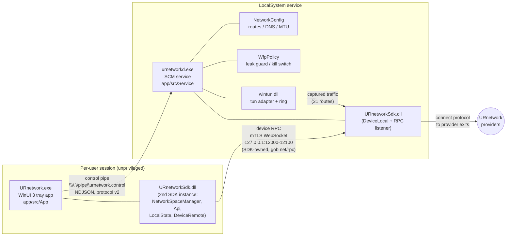

# URnetwork Linux Port — Agent Super Context

**How to use this document.** You are an AI coding agent porting the URnetwork Windows client
(`github.com/Ryanmello07/urnetwork-windows`) to Linux, working in
`github.com/Ryanmello07/urnetwork-linux`. This file is the distilled result of a full
investigation of the Windows client, the Go SDK, the existing Linux repo, and Linux packaging
research (all as of 2026-08-14). The repos contain the code; this document contains the
*decisions, constants, contracts, corrections, and traps* that are not obvious from the code.
Read it top to bottom once, then use it as a reference. Exact constants, message names, file
paths, and timings in this document are normative — do not approximate them. When this document
and a repo README disagree, trust this document (several READMEs are known-stale; see §9 and §12).

**Generated from** (all `Ryanmello07/*` forks unless noted):
`urnetwork-windows` (branches `beta/custom-server`, `beta/algorithm-dpi`),
`urnetwork-sdk` (same branch lines; checks out as directory `sdk`),
`connect` (fork of `urnetwork/connect`, same branch lines),
`urnetwork-linux` (fork of `urnetwork/linux`, audited at commit `21ec37a`, 2026-08-13),
`urnetwork/elements` (design system), and the URnetwork docs site.
This document's home is `docs/linux_agent_help.md` on the **`beta/custom-server`** branch of
`urnetwork-linux`.

Repo prefixes used throughout: `windows:` = urnetwork-windows, `sdk:` = urnetwork-sdk,
`connect:` = the connect fork, `linux:` = urnetwork-linux, `elements:` = urnetwork/elements.

---

## 1. Mission & ground rules

**Mission:** port the Windows client *experience* — two-process architecture, UI feature set,
design/motion language, honesty-first status reporting, leak prevention — to Linux, reusing the
identical Go SDK and as much of the existing `linux:` repo as is still current.

Ground rules (all final unless the owner says otherwise):

1. **Packaging decision is FINAL: NO Snap.** Targets are **AppImage + Flathub (Flatpak) +
   native .deb/.rpm**, aiming at universal Linux coverage. Every remaining Snap artifact in the
   `linux:` repo is superseded and must be removed (complete list in §9.4). Do not resurrect
   `snapcraft.yaml`; it describes a dead single-process architecture and is broken anyway.
2. **Two-process architecture is the model** (already implemented in `linux:`): an unprivileged
   per-user GUI process and a privileged root daemon (`urnetworkd`) that owns the tunnel. The
   GUI must never hold tunnel privileges; every UI action crosses a process boundary. Anything
   the UI must *report* (not just trigger) must return a value across the RPC
   (e.g. `MigrateExit`/`ProbeAllExits` return counts, not void).
3. **The SDK is shared, not reimplemented.** Both processes link the same cgo c-shared SDK
   (`libURnetworkSdk.so`); the device RPC between them is implemented *inside* the SDK and ports
   unchanged. Only the control channel (lifecycle/config) is reimplemented per OS.
4. **Honesty in status is a product feature.** `routes_installed` is THE field for "traffic is
   actually captured"; DNS failure is reported but non-fatal; kill-switch blocking is disclosed
   ("traffic is blocked, not leaking"); empty/loading/failed states must be distinguishable.
   Every default in the wire protocol is chosen so silence *understates* protection.
5. **The daemon is IPv4-only for now** (tunnel refuses IPv6-only networks rather than blackholing
   the machine); the firewall drops IPv6 in the same table.
6. **Do not promise split tunneling in the UI.** It is not delivered on any platform (see §12).
7. **Product tiering (owner decision 2026-08-08):** mobile = simple floor; desktop = advanced.
   Linux, like Windows, ships an app-wide persisted **Advanced Mode** toggle (Portmaster-style,
   inline on every page — "same pages, deeper view", NOT a separate destination), read AND
   write, including the ~34-knob SDK reliability tuning surface and fault injection.
8. **License: MPL-2.0 throughout** (the windows: repo is MPL-2.0 end to end, including the
   split-tunnel driver with its PROVENANCE.md). Keep this repo MPL-2.0 — it satisfies
   Flathub's redistribution requirement and fills the `License:` fields .deb/.rpm metadata
   requires (§10.2). Note the four brand fonts are separately licensed commercial faces
   (§7.17), NOT MPL — check their terms before bundling them into publicly distributed
   packages.

---

## 2. Repo map & branch model

| Repo | Role | Notes |
|---|---|---|
| `github.com/Ryanmello07/urnetwork-windows` | The Windows client being ported — two-process C++ (WinUI 3 app + service), the reference implementation | Fork of `urnetwork/windows`; beta line runs ahead of upstream |
| `github.com/Ryanmello07/urnetwork-sdk` | Go SDK fork — device/API surface + `cgo/` c-shared desktop bindings | **Must be checked out into a directory named `sdk`** (replace-directive requirement), even though the GitHub repo is named `urnetwork-sdk` |
| `github.com/Ryanmello07/connect` | Transport/routing engine fork (fork repo name is just `connect`) | Pure Go; the protocol is connect's own (NOT WireGuard-based) |
| `github.com/Ryanmello07/urnetwork-linux` | THIS repo — the Linux port | Fork of `urnetwork/linux`; upstream `urnetwork/linux` exists; audited state in §9 |
| `github.com/urnetwork/elements` | Official Lit/React design system | Source of truth for brand tokens (`elements:src/index.css`) |
| `github.com/urnetwork/glog`, `github.com/urnetwork/goidenticons` | Small upstream Go deps | Must be sibling checkouts for the SDK build |
| URnetwork docs site (Next.js + MDX) | Product/network documentation | Source of the product description quoted in §12.1 |

**Branch model.** Two long-lived beta branch lines exist across the client-side repos:

- **`beta/custom-server`** — the product/UI line. **This document lives on it.**
- **`beta/algorithm-dpi`** — the smart-routing/DPI line, currently ahead; it is the branch the
  Windows CI pins for sdk/connect checkouts.

The beta branches build ONLY against the fork branches of connect/sdk — **building against
upstream `urnetwork/connect`/`urnetwork/sdk` main will NOT compile** (smart-routing, probe, and
advanced-mode RPCs exist only on the fork branches). Releases publish from the fork; upstream
carries the proving CI for main.

**Merge order when syncing is always `connect → sdk → windows` (and now `→ linux`)** —
dependency order: sdk compiles against connect; the clients compile against sdk's generated
headers.

**Upstream PR workflow:** feature branches target the long-lived beta branch, then get
cherry-picked to a paired `*-upstream` branch cut from upstream main (reliability checkpoint
merged upstream as connect#190, merge commit `9dc9531`; the open stack pattern is
sdk#134/android#468, connect#198/#199/#200, sdk#136/#137).

**CRITICAL CI context:** upstream `urnetwork/connect` has had **zero CI workflows on main since
2026-08-04** — merge `35ceb0f0` ("reliability checkpoint: merge beta/custom-server") resolved to
a parent with no `.github/` and silently dropped `test.yml` + `provider-release.yml` (a restored
`test.yml` exists only on connect's unmerged `beta/message` branch, `c322744`). Until that
lands, the fork's beta pipeline — which compiles all of connect+sdk from source on every push —
is the **only recurring compile proof** for the connect/sdk beta branches. The Linux pipeline
inherits this safety-net duty.

---

## 3. Windows client architecture

Two processes, both load-time-importing the same `URnetworkSdk.dll` (Go cgo c-shared build —
the Go runtime initializes at DLL_PROCESS_ATTACH in both):

- **`URnetwork.exe`** — per-user, unprivileged WinUI 3 C++/WinRT tray app
  (`windows:app/src/App/`). Owns the window, tray icon, SdkHost (auth/API/DeviceRemote),
  ServiceClient (control pipe), updater.
- **`urnetworkd.exe`** — LocalSystem SCM service (`windows:app/src/Service/`). Owns
  DeviceLocal, the wintun adapter + packet pump, routes/DNS/MTU (NetworkConfig), the WFP leak
  guard / kill switch (WfpPolicy), egress monitoring, the split-tunnel driver client.
- **`windows:app/src/Common/`** — shared static lib linked into both (Protocol.h wire format,
  Ids.h identities, Paths, PipeServer/PipeClient, Sdk bootstrap, Heartbeat, AppPrefs, Version
  grammar, pure decision cores).



### 3.1 The two channels

1. **Control pipe** `\\.\pipe\urnetwork.control` — newline-delimited UTF-8 JSON, lifecycle +
   config only (`windows:app/src/Common/Protocol.h`). Server SDDL
   `D:(A;;GA;;;SY)(A;;GA;;;BA)(A;;GRGW;;;AU)` (SYSTEM + Administrators full, Authenticated
   Users read/write; `PipeServer.cpp:22`). Single instance, one client at a time,
   `PIPE_REJECT_REMOTE_CLIENTS`, 64 KiB buffers. `kProtocolVersion = 2`. Messages:
   `hello` / `start_tunnel` / `stop_tunnel` / `get_state` / `set_split_tunnel` /
   `set_kill_switch` / `logout` (app→service); `reply` + `event` (service→app). Full contract
   in §4.
2. **Device RPC** — the SDK's own mTLS WebSocket on loopback, *separate* from the control pipe.
   The app generates per-session key material (`GenerateDeviceRpcKeyMaterial()`), sends the PEMs
   + host:port in `start_tunnel`; the service's `DeviceLocal.SetRpcServer` listens; the app's
   `DeviceRemote` dials and pins the server cert. Port is random per session:
   `SdkHost::RandomLoopbackHostPort()` returns `127.0.0.1:<12000-12100>`
   (`windows:app/src/App/SdkHost.cpp:168`). This mirrors the macOS app↔NetworkExtension boundary
   exactly; `start_tunnel` carries the same fields macOS puts in
   `NETunnelProviderProtocol.providerConfiguration`.

### 3.2 Tunnel bring-up: 8 named steps

`TunnelController::StartLocked` (`windows:app/src/Service/TunnelController.cpp`) runs one
strictly ordered sequence. Steps 1–5 write nothing to the machine ("THE FENCE" sits between 5
and 6):

1. **1/8 wintun** — adapter creation (needs LocalSystem).
2. **2/8 egress (R1)** — discover physical egress ifIndex excluding the tun;
   `setEgressInterfaceIndex` pins the service SDK's own sockets off the tun.
3. **3/8 network space** — NetworkSpaceManager + import from `network_space_json`.
4. **4/8 device** — DeviceLocal from `by_jwt` + network space (+ persisted key material).
5. **5/8 rpc** — mTLS loopback listener the app dials.
6. **6/8 firewall + network config** — the FIRST destructive step: WFP policy, tun address,
   MTU 1440, the 31 capture routes, DNS.
7. **7/8 split tunnel** — optional driver push.
8. **8/8 pump** — wintun packet pump.

**RpcOnly mode = steps 2–5 only**: live DeviceLocal + RPC listener, zero routes, no elevation
needed, network untouched — reports state `rpc_only`. This mode is the keystone that let the
whole UI be built before the tunnel worked; port it (`--rpc-only`). `--stop-after=N` halts at
any step boundary and unwinds via the ordinary `StopLocked` — the staged-verification tool
(details §6.1).

`StartTunnel` carries: `by_jwt`, `network_space_json`, `instance_id`, `device_description`,
`device_spec`, `app_version`, `rpc_server_pem`, `rpc_client_cert_pem`, `rpc_listen_hostport`,
`excluded_app_paths`, `allowlist_mode`, `mode` (`"tunnel"|"rpc_only"`), `kill_switch`.
`TunnelStatus` adds: `routes_installed`, `dns_applied`, `wfp_state`, `egress_index4/6`,
`stop_reason`, `failsafe_armed` (full shapes in §4.3).

### 3.3 Crash-safety design center

On Windows, the wintun adapter and the dynamic BFE WFP session **die with the service process**
— process death is itself the network-restore path (adapter removal takes routes+DNS; the
dynamic session takes the filters). Belts everywhere additionally call
`NetworkConfig::CrashRevert()` (lock-free route delete) before dying.

**On Linux this property is NOT automatic** for the whole set: the tun fd half holds (a
non-persistent fd-owned tun vanishes on close — do NOT set `TUNSETPERSIST`), but nftables rules
and systemd-resolved registrations do NOT die with the process. The marker/sweep/revert design
therefore carries MORE weight on Linux, not less: budget `ExecStopPost=` cleanup + a startup
sweep (by table name) as first-class work (§6.5).

### 3.4 App lifecycle facts (with two corrections to earlier briefs)

- **CORRECTION: `RestartAgent.exe` does not exist** anywhere in the repo (verified across all
  branches). Update relaunch is `AppController::RelaunchOnto`
  (`windows:app/src/App/AppController.cpp:305`): (1) `AppInstance::UnregisterKey()`, (2)
  `CreateProcessW` on the new exe with `--relaunched`, (3) quit via the normal tray-quit path.
  The new process retries the single-instance key **40 × 250 ms** before falling back to the
  ordinary redirect; on spawn failure the old instance re-acquires the key.
- **CORRECTION: the app has NO auto-start** — no Run key, no StartupTask, no launch flag
  anywhere (`App.xaml.cpp:112-119` flags this explicitly); the app cannot distinguish
  login-start from double-click. Only the *service* is `SERVICE_AUTO_START`. The beta app opens
  its window on every launch (upstream starts tray-only). A Linux port adding autostart must
  also add the quiet-at-login signal.
- **Close-to-tray:** `AppWindow.Closing` cancels the close unless `quitting_` is set (tray
  Quit) and calls `HideWindow()` (`AppController.cpp:619`). Tray reopen protocol (also the
  automation hook, `Startup.h:109`): post `WM_APP+1` with `NIN_SELECT` in `LOWORD(lParam)` to
  the hidden window of class `URnetworkTrayWindow` (`NOTIFYICON_VERSION_4` conventions; tray
  icon GUID `{B7E9C2A1-4F3D-4C8E-9A1B-2D6E8F0A1C34}`).
- **Window placement:** single `REG_BINARY` blob at `HKCU\Software\URnetwork\Window`, value
  `Placement` — `StoredPlacement{magic 0x574E5255 'URNW', version 1, ...}`; default size
  **1120×820 DIPs** (min 400×480), rect discarded if it overlaps no live monitor, else clamped.
  Saved on hide-to-tray, on quit, and **700 ms debounced** after a user drag. Tray-click anchors
  the window bottom-right at the icon ONLY until `ownPlacement_` (a restore, save, or observed
  user move), after which the anchor never overrides. On Linux this becomes a settings file —
  and note Wayland forbids global positioning entirely (§10.6), so the anchor logic dies.
- **Single-instancing:** `AppInstance::FindOrRegisterForKey("URnetwork.Desktop")`; a second
  launch redirects activation to the primary (`kRedirectTimeoutMs = 15000`) — this is how a
  `urnetwork://` browser callback (wallet auth, OAuth, checkout) reaches the running instance.
  Linux analogue: GApplication uniqueness / D-Bus name (linux: already uses GApplication with
  HANDLES_OPEN).
- **Service install is app-driven** (`windows:app/src/App/ServiceSetup.h`): the portable zip
  has no installer, so first run of the app installs the service. The app classifies with
  read-only SCM queries (never elevated itself) into states
  `Unknown | NotInstalled | Stopped | Running | VersionMismatch | ConsoleMode` (pipe alive but
  no RUNNING service = a developer `urnetworkd console`; show nothing). One banner, one click,
  **one UAC `ShellExecuteExW` runas** on the **sibling** `urnetworkd.exe` with verb `install` —
  idempotent by design: stop-if-running (bounded), re-point binPath at the sibling exe, start;
  **exit 0 iff RUNNING at the end** (the invisible child console makes the exit code the whole
  interface). VersionMismatch compares VERSIONINFO ProductVersion of the registered exe vs the
  sibling. Failure actions: escalating restarts **5 s / 10 s / 60 s with the LAST action always
  RESTART** (repeats forever). Linux analogue: pkexec/polkit first-run flow installing unit +
  daemon, `systemctl enable --now` (§10.3).
- **Storage split:** app `%LOCALAPPDATA%\URnetwork\app` (overridable via `URNETWORK_APP_ROOT`
  — app only, deliberately not the service), service `%ProgramData%\URnetwork\service`; the
  two processes deliberately share NO storage.
- **Reattach blob** `%LOCALAPPDATA%\URnetwork\app\rpc_session.json` =
  `{client_pem, server_cert_pem, host_port, instance_id}`. `instance_id` MUST be the id the
  service's DeviceLocal was **born with** at `start_tunnel` — the SDK rotates the on-disk id on
  JWT refresh, so pairing with the disk id makes reattach permanently unpairable (§4.6).

### 3.5 Stated design intent worth keeping

- `windows:PLAN.md`: the design mirrors macOS — control pipe replaces
  `NETunnelProviderManager` + `providerConfiguration` + `handleAppMessage`; the device RPC is
  "exactly the macOS app↔extension channel". Adapter IP defaults
  `DeviceLocal.TunnelLocalAddress()` fallback `169.254.2.1/24`, MTU 1440.
- `windows:README.md` beta-only features: open-on-launch, UrMotion, Onboarding, structurally
  separate Simple mode, smart routing (observing; only `ScoredAffinityDonor` steers,
  zero-value-off).
- SDK bindings (`exports_gen.go`, `urnetwork_sdk.hpp`) are committed artifacts regenerated with
  `GOOS=linux ./gen_tool` — on a Windows host the generator **silently drops
  `!windows`-tagged declarations** (like `IoLoop`). Linux is the generator's native mode.

---

## 4. The UI ↔ daemon IPC/RPC contract

There are **two separate channels**. The control channel (lifecycle + config, ~7 request types)
is what the Linux port reimplements (Unix socket + polkit); the device RPC (everything else) is
SDK-owned and ports unchanged — but its bootstrap/persistence/reattach choreography must be
reproduced exactly.

### 4.1 Control channel: transport & framing (Windows reference)

- Pipe `\\.\pipe\urnetwork.control` (`windows:app/src/Common/Ids.h`), byte-mode, **newline-
  delimited UTF-8 JSON** — one object per line, `\n`-terminated, both directions; reader
  accumulates and splits on `\n`, empty lines skipped; 64 KiB buffers, 4096 B read chunks.
- **Single instance, one client at a time**; `PIPE_REJECT_REMOTE_CLIENTS`. SDDL
  `D:(A;;GA;;;SY)(A;;GA;;;BA)(A;;GRGW;;;AU)`. Design note pinned in source: the pipe ACL only
  keeps anonymous/network principals out — **the real authorization for tunnel control is the
  device RPC's mTLS keys** (only the process that generated the session key material can drive
  the device).
- Every message has a top-level `"type"`. Service→app: `"type":"reply"` (matched by arrival
  order — single in-flight call) and `"type":"event"` (unsolicited).
- Serialization: `DumpForWire()` uses U+FFFD replacement on invalid UTF-8 (SDK-supplied error
  strings pass through verbatim); a total failure sends the literal
  `{"type":"reply","ok":false,"error":"the service could not serialize its reply"}`
  (`kUnserializableReplyJson`). Events are advisory — a drop is tolerated because the app
  re-reads state on the next request.

### 4.2 Client behavior contract (PipeClient — the app layer assumes exactly this)

- `Connect()`: **5 attempts × 100 ms** `WaitNamedPipe` between busy attempts ≈ **500 ms
  budget** (deliberately shrunk from 20×500 ms because startup calls it synchronously before
  the window shows). Any error other than pipe-busy fails immediately ("service not running").
  `Connect()` begins with `Close()` — reclaims the old handle and **joins the dead reader
  thread** (skipping this caused std::terminate on reconnect after a service restart).
- `Call(request, timeout=30000 ms)`: writes one line, blocks for the next non-event line.
  **One in-flight call at a time.**
- Disconnect handler: fired **once per connection, on the reader thread**, only for an
  unasked-for break — the app's only notice the service died (and took the tunnel with it).
  **A handler must not call Connect()/Close() on the same object** (self-join). App reaction
  (`SdkHost::OnServiceDisconnected`): clamp `routes_installed=false`, `dns_applied=false`,
  `wfp_state="off"`, unbind egress, push a fail-safe status, start the reconnect watchdog.
- Reconnect watchdog (`SdkHost::ServiceWatchdogLoop`): every **3 s**, a zero-cost
  `WaitNamedPipeW(name, NMPWAIT_NOWAIT)` probe; when the pipe listens again and the user is
  signed in → `EnsureSession("the service came back")` — **attach-only**.

Keep on Linux: single-client, single-in-flight, reply-then-event, ~500 ms connect budget, 30 s
call timeout, once-per-connection disconnect callback, 3 s comeback probe.

### 4.3 Message vocabulary (complete)

`kProtocolVersion = 2`; `kFirstStartModeVersion = 2` (first version whose `start_tunnel`
honours `mode`). Version is negotiated one-way: the service reports `protocol_version` in every
`TunnelStatus`; **the app must refuse rpc-only requests against `protocol_version < 2`** — a v1
service silently drops `StartTunnel.mode` and would rewrite routes for a request that asked for
none. In-source bump rule: bump only when a peer silently dropping the new field means the
*opposite* of what was asked (true for `mode`; false for `kill_switch`/`dns_applied`/
`wfp_state`/`egress_index*`/`stop_reason`/`failsafe_armed`, which all default in the safe
direction). An unknown `mode` string **throws** (failed reply, nothing starts) — never defaults
to a real tunnel.

| type | dir | body | reply |
|---|---|---|---|
| `hello` | app→svc | none | `ok:true` + full `status` |
| `get_state` | app→svc | none | `ok:true` + full `status` |
| `start_tunnel` | app→svc | StartTunnel (below) | `ok` = session live AND served mode == requested mode; `status`; then a pushed event |
| `stop_tunnel` | app→svc | none | `ok:true` + `status`; pushed event |
| `set_split_tunnel` | app→svc | `excluded_app_paths:[string]`, `allowlist_mode:bool` | `ok` + `status` |
| `set_kill_switch` | app→svc | `on:bool` | `ok` + `status`; pushed event |
| `logout` | app→svc | none | `ok:true` + `status`; pushed event. Stops tunnel (finalDisarm) and **deletes persisted device identity** (`client_key_seed.bin`, `provide_cert.pem`, `provide_key.pem`) |
| `reply` | svc→app | `ok:bool`, `error:string`, `in_reply_to:string`, optional `status:TunnelStatus` | — |
| `event` | svc→app | `event:"tunnel_state"`, `status:TunnelStatus` | — |

Unknown request type → `ok:false, error:"unknown request type: <t>"`. Any handler exception →
`ok:false` with `e.what()`. `tunnel_state` events fire on every transition **including failsafe
teardowns** (the one transition with no request to ride on).

**StartTunnel** fields:

```
by_jwt               string   client JWT for this device (SECRET — never log)
network_space_json   string   NetworkSpace.toJson() from the app
instance_id          string   device instance UUID the DeviceLocal is born with (canonical 36-char dashed)
device_description   string   e.g. computer name
device_spec          string   hardware/model string
app_version          string   "<version>-<build>"
rpc_server_pem       string   server cert+key the service's RPC listener presents (SECRET)
rpc_client_cert_pem  string   client cert the service pins (mTLS)
rpc_listen_hostport  string   e.g. "127.0.0.1:12042" — where DeviceLocal listens
excluded_app_paths   [string] split tunnel process image paths
allowlist_mode       bool     false: paths BYPASS tunnel; true: only these paths tunnel
mode                 string   "tunnel" | "rpc_only"; absent = tunnel; UNRECOGNIZED = fatal
kill_switch          bool     persisted user preference; absent = false (permissive)
```

**TunnelStatus** fields (the one status shape, used in every reply and event):

```
state                  "stopped"|"starting"|"up"|"stopping"|"error"|"rpc_only"
                       (unknown string parses as "stopped" — safe direction)
rpc_listen_hostport    echoed listener endpoint (empty when none)
error                  set when state=="error"
service_version        SDK version string (MAY BE EMPTY — never use as liveness marker)
protocol_version       int (kProtocolVersion of the peer)
tunnel_local_up_millis int64 best-effort uptime
mode                   "tunnel"|"rpc_only" — the SESSION's mode; survives starting/stopping/
                       error; unreadable degrades to rpc_only (claims less)
routes_installed       bool — THE field for "is traffic actually captured right now"
dns_applied            bool — resolver actually accepted; independent of routes_installed
                       (DNS-half failure deliberately does not tear the tunnel down)
wfp_state              "off"|"armed"|"connecting"|"connected"
egress_index4/6        int64 ifIndex the SERVICE pinned its own SDK egress to; the app binds
                       its second SDK instance to the same physical interface (0 = do not bind)
stop_reason            "" | "user" | "failsafe_no_exit" | "failsafe_no_inbound" |
                       "failsafe_sdk_unresponsive"   (spellings owned by TunnelWatchdog.h:207-211)
failsafe_armed         bool — dead-tunnel countdown within kFailsafeNoticeMillis=30000 of firing
```

Shared predicates the whole product uses (`Protocol.h`):
- `IsSessionLive(state)` = `up || rpc_only` — reattach decisions.
- `IsTunnelUp(state)` = `up` only — anything the user reads as "connected".
- `IsFailsafeStop(reason)` = starts-with `"failsafe_"`.

Client-side: `answered` (transport-level out-param, = `r.ok && r.status.has_value()`) is the
marker for "the service actually replied" — a failed call's default TunnelStatus is
indistinguishable from "nothing running".

### 4.4 Device RPC: mTLS WebSocket bootstrap (SDK-owned; reproduce the choreography)

Fresh-session sequence (`SdkHost::BootstrapSession`, `SdkHost.cpp:1723`):

1. `km = urnet::generateDeviceRpcKeyMaterial()` — SDK mints **two independent self-signed
   ECDSA P-256 certs** (server, client): CN "urnetwork device rpc", 1-year validity, SANs
   localhost/127.0.0.1/::1 (SANs are cosmetic — **pinning is exact raw-cert equality**,
   `sdk:device_rpc_transport.go` `pinVerifier`). Four PEM strings: `serverPem` (cert+key),
   `serverCertPem` (cert only), `clientPem` (cert+key), `clientCertPem` (cert only). Client
   private key never crosses to the service; server private key never comes back to the app.
2. `hostPort = "127.0.0.1:" + rand(12000..12100)` (Windows app override; the SDK's own default
   is `deviceRpcDefaultAddress = "127.0.0.1:12025"`, with an SDK-side port range
   12025–12124 — the 12025 default is what `linux:` uses, §9.2).
3. `start_tunnel` carries `rpc_server_pem=km.serverPem`, `rpc_client_cert_pem=km.clientCertPem`,
   `rpc_listen_hostport=hostPort`.
4. Service (bring-up step 5/8): `device_->setRpcServer(server_pem, client_cert_pem, hostPort)`
   → SDK `DeviceLocal.SetRpcServer` (`sdk:device_local.go:3807`) starts a
   `WebsocketDeviceRpcListener` presenting serverPem and **requiring + pinning** clientCertPem
   (`tls.RequireAnyClientCert` + exact-match verifier).
5. App: `device_ = urnet::newDeviceRemoteWithDefaults(networkSpace, clientJwt, instanceId)`,
   then `device_->setRpcServer(km.clientPem, km.serverCertPem, hostPort)` — dialer presents
   clientPem, pins serverCertPem.
6. App persists `rpc_session.json` with the **exact instance_id string sent in start_tunnel**
   (never a re-read of LocalState).

Transport internals (identical on Linux): one `wss://<hostPort>/` connection (TLS ≥ 1.2); every
WebSocket **binary** message is `[streamTag][payload]` — tag `0` = forward stream (DeviceRemote
is the `net/rpc` gob client of service-side `DeviceLocalRpc`), tag `1` = reverse stream
(DeviceLocal is the `net/rpc` client of app-side `DeviceRemoteRpc`). Keepalive = zero-length
binary message every 5 s; read deadline 20 s; OS TCP keepalive also on. Timings
(`defaultDeviceRpcSettings`, verified against `sdk:device_rpc.go:119-138`): `RpcCallTimeout`
**60 s**, `RpcConnectTimeout` **30 s**, `RpcReconnectTimeout` **500 ms** (paced reconnect
loop), `InitialLockTimeout` **1 s**, `KeepAliveTimeout` 5 s, `MuxWriteTimeout` 15 s. (An
earlier investigation pass reported 4 s call / 5 s connect here; the sdk source says
otherwise — trust these values.) Protocol constants: `DeviceRpcVersion = 1`, WS binary
opcode 2, ping 9.

### 4.5 Device RPC: handshake and method vocabulary

**Handshake:** dial → `rpc.NewClient(forwardConn)` → call
**`DeviceLocalRpc.Sync(DeviceRemoteSyncRequest) → DeviceRemoteSyncResponse`** — the request
carries `InstanceId` plus id-sets of every registered listener (30+ families) and queued
offline state. **Instance pairing rule** (`sdk:device_rpc.go:6899`): a nonzero
`InstanceId != deviceLocal.instanceId` is rejected before any side effect with
`"device instance mismatch: remote expects %s, local is %s"` — **permanently** (remote retries
forever at 1 s pace, stays unsynced); a **zero id skips the check** (legacy — do not "fix"
that). On success: remote registers its reverse server, calls `DeviceLocalRpc.SyncReverse`,
adopts `syncResponse.State`, clears queued state (except a non-nil queued ReliabilitySettings
override, which re-applies every reconnect), fires `RemoteChanged(true)`, detects hosted-device
recreation via `syncResponse.DeviceGeneration`. Auth is entirely the mTLS mutual pin — no
credential inside the RPC.

**Forward methods — `DeviceLocalRpc.*`** (complete, `sdk:` beta/custom-server):
- Session: `Sync`, `SyncReverse`, `UploadLogs`.
- Connect/destination: `SetConnectLocation`, `GetConnectLocation`, `GetConnectEnabled`,
  `SetDestination`, `RemoveDestination`, `SetDefaultLocation`, `GetDefaultLocation`, `Shuffle`,
  `SetTunnelStarted`, `GetTunnelStarted`.
- State/prefs: `Get/SetPerformanceProfile`, `Get/SetProvideControlMode`, `Get/SetProvideMode`,
  `GetProvideEnabled`, `Get/SetProvidePaused`, `Get/SetProvideNetworkMode`, `Get/SetRouteLocal`,
  `Get/SetOffline`, `Get/SetVpnInterfaceWhileOffline`, `Get/SetAllowForeground`,
  `Get/SetCanRefer`, `Get/SetCanShowRatingDialog`, `GetShouldShowRatingDialog`,
  `Get/SetCanPromptIntroFunnel`, `LoadProvideSecretKeys`, `InitProvideSecretKeys`.
- Status/stats: `GetContractStatus`, `GetWindowStatus`, `GetStats`, `WindowMonitorEvents`,
  `IngressSecurityPolicyStats`, `EgressSecurityPolicyStats`, `ResetIngress/
  EgressSecurityPolicyStats`, `GetPacketStats`, `GetEgress/IngressContractStats/Details`,
  `GetProviderPacketStats`, `GetProviderEgress/IngressContractStats/Details`,
  `GetProviderIdentities`, `GetPublicIdentityKey`, `GetNetworkPeers`.
- Blocker/DNS/split rules: `Get/SetBlockerEnabled`, `GetBlockActions`, `GetBlockStats`,
  `Get/SetBlockActionOverrides`, `Add/RemoveBlockActionOverride`, `GetLocalOverrideAppIds`,
  `Get/SetDnsResolverSettings`.
- API relay: `HttpGetRaw`, `HttpPostRaw` (async responses via reverse `HttpResponse`).
- Reliability/advanced: `Get/Set/ResetReliabilitySettings`, `Get/ResetReliabilityMetrics`,
  `GetExits`, `GetDestinationExits`, `MigrateExit`, `ProbeAllExits`, `SimulateNetworkChange`.
- Listener registration: `Add<X>Listener`/`Remove<X>Listener` for every reverse family below.

**Reverse events — `DeviceRemoteRpc.*`** (complete): `ConnectChanged`,
`ConnectLocationChanged`, `ContractStatusChanged`, `DefaultLocationChanged`,
`WindowStatusChanged`, `WindowMonitorEventCallback`, `TunnelChanged`, `OfflineChanged`,
`RouteLocalChanged`, `VpnInterfaceWhileOfflineChanged`, `ProvideChanged`,
`ProvidePausedChanged`, `ProvideModeChanged`, `ProvideControlModeChanged`,
`ProvideNetworkModeChanged`, `ProvideSecretKeysChanged`, `ProviderIdentitiesChanged`,
`PerformanceProfileChanged`, `AllowForegroundChanged`, `CanReferChanged`,
`CanShowRatingDialogChanged`, `CanPromptIntroFunnelChanged`, `BlockerEnabledChanged`,
`BlockActionWindowChanged`, `BlockActionOverridesChanged`, `BlockStatsChanged`,
`DnsResolverSettingsChanged`, `PacketStatsChanged`, `Egress/IngressContractStatsChanged`,
`Egress/IngressContractDetailsChanged`, `ProviderPacketStatsChanged`,
`ProviderEgress/IngressContractStatsChanged`, `ProviderEgress/IngressContractDetailsChanged`,
`NetworkPeersChanged`, `HttpResponse`.

**Fault-injection / advanced-mode surface the app calls** (fork sdk `beta/custom-server` only —
NOT on upstream main; wrapper `urnetwork_sdk.hpp` ~10785-10824 on DeviceRemote):
`bool dropExit(exit_client_id)`, `bool stallExit(exit_client_id, stalled)`,
`void shuffleExits()`, `int64_t probeAllExits()` (count), `int64_t migrateExit(exit_client_id)`
(migrated-flow count; **-1 = not-found sentinel, not a count** — 0 is a real result),
`void simulateNetworkChange()` (drill; distinct from the daemon's real `networkChanged()`),
`bool startProbeSuite(optional<ProbeSuiteConfig>)`, `void stopProbeSuite()`,
`bool probeSuiteRunning()`, `optional<ProbeResultList> getProbeResults()`,
`optional<ExitList> getExits()`, `optional<DestinationExitList> getDestinationExits()`,
`optional<ReliabilitySettings> getReliabilitySettings()` (**nullopt = "nothing in force"; never
substitute a zeroed struct on the write path** — an all-zero override disables the whole
stack), `setReliabilitySettings`, `resetReliabilitySettings`, `resetReliabilityMetrics`,
`getReliabilityMetrics`, `bool getRemoteConnected()`, `std::string getSyncError()`,
`void sync()`. Rule pinned by SDK test `TestDeviceRemoteAdvancedModeActionsAreNeverQueued`:
fault-injection actions are **immediate-or-nothing** — never queued into sync state, never
replayed after reconnect (a replayed dropExit would drop a different, healthy exit).

**Provider locations have two independent sources by design:** (a) session-less —
`GET /network/provider-locations` (no auth) via the in-process Api, search via
`findProviderLocations{query}`; (b) with a session — `LocationsViewController` on the
DeviceRemote (authoritative when present; single-writer gate). The connected-providers sheet
uses `ProviderLocationsViewController` (window contents, display-ordered west→east).

### 4.6 `rpc_session.json` — the reattach blob (exact rules)

Path: `%LOCALAPPDATA%\URnetwork\app\rpc_session.json`; format
(`windows:app/src/Common/RpcSessionBlob.h`, pure header, selftest-pinned):

```json
{"client_pem":"...","server_cert_pem":"...","host_port":"127.0.0.1:12042","instance_id":"<36-char dashed uuid or empty>"}
```

- All four keys always written, even when empty. Parse: non-object / unparseable / missing
  `host_port` → "no session". `instance_id` validated **stricter than the SDK**: exactly the
  canonical 36-char dashed hex form, nil UUID refused (a zero id would *skip* the service's
  pairing check); anything else degrades to empty = "session exists but must not be paired" →
  start fresh. **Never hand the SDK an empty instance id** — it maps to a nil `*Id` across cgo
  and yields a handle-0 DeviceRemote that throws nothing and does nothing.
- `instance_id` is the **born-with** id (JWT refresh rotates the LocalState `.instance_id`
  while the running DeviceLocal keeps its birth id; reattaching with the drifted id renders as
  a live tunnel showing Disconnected with no providers, forever).
- Written only after a successful fresh `start_tunnel`; **deleted** in
  `TeardownSessionLocked` (disconnect-with-stop, logout, re-registration).
- **Operational rule (cost live debugging rounds twice):** a stale blob left by an
  `urnetworkd console --rpc-only` run makes the app silently adopt an rpc-only session and
  never build a real tunnel (reattach matches `hello.rpc_listen_hostport == blob.host_port`
  and live-mode == requested-mode). Never leave an `--rpc-only` console running; delete
  `rpc_session.json` after any rpc-only test run.

### 4.7 Reattach semantics (D8 policy)

`BootstrapSession(reason, attachOnly)` is the single entry for fresh + reattach:

1. Require stored client JWT.
2. Connect pipe → `hello`. The hello reply is a full TunnelStatus and **the only status a
   reattach ever sees** — adopt ALL of it (routes/dns/wfp/egress facts, not just state+mode).
3. rpc-only guards: refuse RpcOnly against `protocol_version < 2`; refuse to attach to a live
   *tunnel* when RpcOnly was requested (attaching confers teardown authority).
4. Reattach iff `IsSessionLive(hello.state)` AND `hello.mode == requestedMode` AND a parsed
   blob exists AND `hello.rpc_listen_hostport == blob.host_port`. Empty blob `instance_id` →
   give up reattach (Connect gesture starts fresh; a resume declines).
5. **D8 (owner decision): the tunnel starts only on an explicit Connect gesture.** Attach-only
   callers (launch resume, network-server change, service-comeback watchdog) NEVER cold-start
   a tunnel — `attachOnly && !reattaching` → decline (flag, not error).
6. On reattach: blob PEMs + host_port + **saved** instance id. **Never re-issue
   SetConnectLocation on reattach** — once Sync passes, SyncReverse replays
   `ConnectLocationChanged` + a window-monitor reset and everything self-heals; re-issuing
   would rebuild the live provider window.
7. **Sync watchdog:** 5 s after bootstrap (`kSyncSettleDeadline = 5000 ms`), read
   `getSyncError()`/`getRemoteConnected()` — a standing sync error (permanent by construction)
   degrades the refused reattach to a fresh session instead of a screen that renders nothing.
8. Mode mismatch on fresh start: asked rpc_only got tunnel → stop it and refuse; asked tunnel
   got rpc_only with `routes_installed=false` → **adopt it loudly** (the clamped `--rpc-only`
   console workflow), with stats clamped: `connectionStatus="RPC_ONLY"`, `connected=false` —
   no surface may claim a tunnel.
9. `start_tunnel` reply rule: `ok = IsSessionLive(st.state) && st.mode == cfg.mode` — a
   clamped service serving a different mode is live but NOT ok.

### 4.8 Linux mapping (and what linux: already implements — see §9.2 for its current protocol)

- Pipe → **Unix domain socket** `/run/urnetwork/control.sock`, same NDJSON framing. SDDL →
  socket dir/file mode + group (`/run/urnetwork` 0750 root:urnetwork, socket 0660) +
  `SO_PEERCRED` per-accept checks; privileged verbs (`start_tunnel` in tunnel mode,
  `set_kill_switch`, `logout`) are where polkit slots in; `hello`/`get_state`/`status` stay
  unauthenticated so the UI can render service state before any grant.
- The Windows twin bug to backport-fix: `windows:` `kProtocolVersion` is set in
  `Service/TunnelController.cpp` but **never checked in `App/ServiceClient.cpp`**; `linux:`
  enforces version in BOTH directions (`kControlProtocolVersion=1`,
  `kMinSupportedClientProtocol=1`, `kMinSupportedDaemonProtocol=1`) plus an **exact
  `urnet::version()` match both ways** (`SdkVersionsAgree`; empty fails closed) — necessary
  because the gob device RPC has no version negotiation and GUI/daemon update on independent
  schedules (zsync vs apt).
- The device RPC needs no reimplementation: link the same SDK, same four-PEM split, keep the
  loopback TCP listener, persist/clear the reattach blob at the same lifecycle points, keep the
  born-with-instance-id pairing. `linux:` pins the SDK default port **127.0.0.1:12025**
  (`kDeviceRpcPort = 12025` in `linux:app/src/ControlProtocol.hpp`); a unix-socket transport
  for the device RPC is a recorded, deliberately deferred SDK change (touches every platform).
  Consequence: a root daemon binding a loopback port any local user can reach makes the control
  socket the entire authorization boundary — keep it tight.

---

## 5. The Go SDK & bindings (cgo, c-shared for Linux)

### 5.1 Module layout and replace conventions

Every URnetwork Go module resolves siblings through `replace ... => ../<dir>` — a lone clone
does not build and fails with a misleading "missing go.sum entry".

- `sdk:go.mod` — `module github.com/urnetwork/sdk`, Go `1.26.5`; replaces
  `connect => ../connect`, `glog => ../glog`, `goidenticons => ../goidenticons`.
- `sdk:cgo/go.mod` — separate module `github.com/urnetwork/sdk/cgo`; replaces `sdk => ..`,
  `connect => ../../connect`, `glog => ../../glog`, `goidenticons => ../../goidenticons`.
  **Its `go.sum` is git-ignored/generated** — CI runs `go mod download all` when missing;
  builds refuse to proceed without it (module prep belongs upstream of the build).
- **Directory names must match the replace targets exactly**: `sdk`, not `urnetwork-sdk`;
  required siblings in one parent: `connect/ sdk/ glog/ goidenticons/`.
- `connect` is the transport engine (protobuf frame protocol in `connect:protocol/frame.proto`,
  contracts/transfer, multi-hop/multi-client egress, gvisor userspace IP stack, DoH/resilient
  dialing, pion WebRTC p2p, smart-routing classifier). **Do not describe the system as
  WireGuard-based** — the transport is connect's own protocol.

### 5.2 Generator recipe (committed artifacts)

`sdk:cgo` is a `package main` cgo module built with `-buildmode=c-shared`. Regenerate bindings
from `sdk:cgo` with **`go run ./gen`** (or `go build -o gen_tool ./gen && GOOS=linux
./gen_tool`) — **the generator must run as GOOS=linux** or it silently drops `!windows`-tagged
declarations (`IoLoop`, `NewIoLoop`, `IoLoopDoneCallback` are in `unixOnlySymbols`). Linux is
the generator's native mode. Committed outputs:

- `sdk:cgo/exports_gen.go` (~11,900 lines) + `exports_gen_unix.go` (`//go:build !windows`)
- `sdk:cgo/callbacks.h` / `callbacks.c` (cgo cannot call C function pointers directly)
- `sdk:cgo/include/urnetwork_sdk.h` (public C header / ABI contract)
- `sdk:cgo/include/urnetwork_sdk.hpp` (~20,000-line generated header-only C++17 wrapper)
- `sdk:cgo/include/urnetwork_sdk.def` (Windows-only module definition; Linux exports come from
  the `.so`)
- `sdk:cgo/coverage_report.txt` — every exported symbol (currently **700 exported functions**)
  and every skipped symbol with the reason.

`sdk:cgo/gen/abi_baseline_test.go` asserts every symbol in
`gen/testdata/exported_symbols.txt` is still present in the `.def` — an ABI ratchet; keep it
green whenever regenerating. The generator fails on C name collisions and warns on data types
with empty JSON shapes. Hand-written exports: `exports_core.go` (`urnet_version`,
`urnet_free_string`, `urnet_release`, `urnet_live_handle_count`, never-called `main()`) and
`exports_manual.go` (buffer-out pattern for byte results: base58 decode, decrypt, shared
secret, client key seed / provide-TLS PEM getters, identicon PNG, public identity key,
packet-batch get; contract: `*inout_len` always set to needed size, copy+`true` only when `out`
non-null and capacity suffices).

### 5.3 The C ABI contract

- Objects cross as **opaque `uint64_t` handles** (RWMutex map in `handles.go`; ids strictly
  increasing, **never reused**). **Zero handle is null** (legal "no object"; resolves ok=false
  without logging; argument-position 0 translates to a nil Go value). Release every returned
  handle with `urnet_release(h)`; **releasing does NOT close/stop the object** — call
  `*_close`/`*_stop` first where one exists. `urnet_live_handle_count()` supports leak checks.
- Every export defers `cgoGuard(name)` — a panic must never unwind into C.
- Returned `char*` are caller-owned; free with `urnet_free_string`. `const char*` params are
  borrowed. Structured data crosses as UTF-8 JSON; `sdk.Id` as UUID string; `sdk.Time` as unix
  **epoch milliseconds** (0 = none); `[]byte` params as `(const uint8_t*, int32_t)`.
- Callbacks fire on arbitrary **Go threads**; string/buffer args valid only during the call;
  handles passed to callbacks are owned by the receiver and must be released. The one
  string-returning callback, `urnet_flow_owner_lookup_cb`, must return **malloc'd** memory (Go
  frees it with `free()`).
- Load-bearing `#define URNET_*` constants: `URNET_CONNECTED/CONNECTING/DESTINATION_SET/
  DISCONNECTED/CONNECT_FAILED`, `URNET_DEVICE_RPC_VERSION 1`, `URNET_DEVICE_RPC_WS_BINARY 2`,
  `URNET_DEVICE_RPC_WS_PING 9`, `URNET_PROVIDE_MODE_{NONE 0,NETWORK 1,FRIENDS_AND_FAMILY 2,
  PUBLIC 3,STREAM 4}`, `URNET_ROUTING_TIER_{OFF 0,LIGHT 1,FULL 2}`,
  `URNET_LOCAL_STORAGE_FILE_PERMISSIONS 448` (0700).

Core signatures:

```c
char*    urnet_version(void);            /* value of -X github.com/urnetwork/sdk.Version */
void     urnet_free_string(char* s);
bool     urnet_release(uint64_t handle); /* false if unknown */
int64_t  urnet_live_handle_count(void);
bool     urnet_set_log_dir(const char* log_dir, char** out_error);
void     urnet_set_memory_limit(int64_t limit);
void     urnet_set_egress_interface_index(int64_t index4, int64_t index6); /* INERT off Windows */
uint64_t urnet_new_network_space_manager(const char* storage_path);
uint64_t urnet_new_network_space_manager_no_storage(void);
```

### 5.4 The C++ wrapper conventions (`urnetwork_sdk.hpp`)

Generated, header-only, C++17, requires **nlohmann/json 3.12.0** (single header vendored; vcpkg
deliberately dropped). `urnet::detail::Handle` is a move-only owner calling `urnet_release` on
destruction — destruction does NOT close/stop, **except `urnet::Sub`, which closes
(unsubscribes) on destruction** like a scoped connection (every `add*Listener` returns a Sub).
**C++ trap: never call `.reset()` on `urnet::Sub`** (bypasses close → use-after-free); assign
`urnet::Sub{}` instead. Data types are typed structs with generated `from_json`/`to_json`;
failures throw `urnet::Error`. Callbacks fire on Go threads — marshal to the UI thread.

**parseJson null-list pitfall (fixed both sides, keep the belt):** Go used to marshal a nil
backing slice as the JSON document `null`; `nlohmann::json::parse("null").get<std::vector<T>>()`
threw `type_error.302` out of innocuous getters. Fixes: hpp boundary guard
`if (j.is_null()) { return T{}; }` (hpp lines 82–101) AND `sdk:gomobile.go`
`exportedList.MarshalJSON` now emits `[]`. Struct `from_json` opens with
`if (!j.is_object()) return;` — that early return is the entire null tolerance for structs.
The Windows app still belt-and-braces every list-shaped getter through `ReadSdkList`
(`windows:app/src/Common/Sdk.h`) because third_party headers are an unpinned build artifact —
**adopt the same policy on Linux**.

### 5.5 Building the SDK: Windows recipe (reference) and the already-scripted Linux build

Windows DLL recipe (per arch amd64/arm64):

```
GOEXPERIMENT=greenteagc CGO_ENABLED=1 GOOS=windows GOARCH=<arch> CC=<mingw-clang> \
go build -trimpath -buildmode=c-shared \
  -ldflags "-s -w -X github.com/urnetwork/sdk.Version=${WARP_VERSION} -buildid=" \
  -o build/windows/<arch>/URnetworkSdk.dll .
```

CC is `x86_64-w64-mingw32-{gcc,clang}` for amd64, `aarch64-w64-mingw32-clang` (llvm-mingw,
pinned release **20250709**) for arm64. CI builds the Windows DLLs **on ubuntu-latest**,
asserts each DLL exists and is **≥ 5,000,000 bytes** (the Makefile chains recipes with `; \`,
so a failed `go build` still exits 0 after the header `cp` — a broken build once shipped a
"green" zip of three headers and no DLL), uploads artifact **`urnetwork-sdk-windows`**. The app
consumes it via `windows:app/tools/fetch-deps.ps1` → `third_party/urnetwork-sdk/<arch>/` +
`lib.exe /def:urnetwork_sdk.def` import lib; local dev drops the zip at
`.local-deps/URnetworkSdkWindows.zip`.

**The Linux build is ALREADY scripted** in `sdk:cgo/Makefile` (`build_linux_amd64` /
`build_linux_arm64`):

```
GOEXPERIMENT=greenteagc CGO_ENABLED=1 GOOS=linux GOARCH=amd64 CC="zig cc -target x86_64-linux-gnu.2.35" \
go build -trimpath -buildmode=c-shared -ldflags "-s -w -X github.com/urnetwork/sdk.Version=${WARP_VERSION} -buildid=" \
  -o build/linux/amd64/libURnetworkSdk.so .
```

(arm64: `zig cc -target aarch64-linux-gnu.2.35`.) The `-gnu.2.35` pin is the **Ubuntu 22.04
glibc floor** (stated support target "Ubuntu 22.04+ (amd64, arm64; glibc >= 2.35)"). Output:
`build/linux/{amd64,arm64}/libURnetworkSdk.so` + the checked-in headers, zipped as
`build/URnetworkSdkLinux.zip`. No `.def`/import lib on Linux — link `-lURnetworkSdk` or dlopen.
On a native Linux builder plain gcc/clang works for the host arch; zig is only for glibc
pinning and cross-arch. Note zig issue #25415 means the pin is not self-verifying — gate with
readelf (linux: `tests/glibc-floor-gate.sh`, §9). Artifact layouts to keep byte-identical:

```
URnetworkSdkWindows.zip                URnetworkSdkLinux.zip
└── windows/                           └── linux/
    ├── amd64/  URnetworkSdk.dll +         ├── amd64/  libURnetworkSdk.so +
    │           urnetwork_sdk.{h,hpp,def}  │           urnetwork_sdk.{h,hpp}
    └── arm64/  (same four files)          └── arm64/  (same three files)
```

CI artifact names: `urnetwork-sdk-windows` → mirror as `urnetwork-sdk-linux`; local drop point
`.local-deps/URnetworkSdkWindows.zip` → `.local-deps/URnetworkSdkLinux.zip`.

### 5.6 Architecture to copy: who owns which SDK object

- **Privileged daemon** owns: NetworkSpace (from `importNetworkSpaceFromJson`), **DeviceLocal**
  (the connect/tunnel engine), stable provider identity via `DeviceLocalKeyMaterial`
  (`client_key_seed.bin` + provide-TLS cert/key PEMs via buffer-out exports), and the RPC
  listener: `GenerateDeviceRpcKeyMaterial()` → `DeviceLocal.SetRpcServer(serverPem,
  clientCertPem, hostPort)` (e.g. `"127.0.0.1:12042"` on Windows; SDK default
  `deviceRpcDefaultAddress = "127.0.0.1:12025"`).
- **Unprivileged UI** owns: NetworkSpaceManager, Api, AsyncLocalState/LocalState, and a
  **DeviceRemote**: `NewDeviceRemoteWithDefaults(networkSpace, byJwt, instanceId)` +
  `DeviceRemote.SetRpcServer(clientPem, serverCertPem, hostPort)`. It never owns the tunnel.
- Both call `SdkInit`: `urnet::setLogDir(...)` + `urnet::setMemoryLimit(64 MiB)`
  (`kServiceMemoryLimit = 64ll*1024*1024`; matches the macOS caps — the daemon is
  intentionally memory-bounded).
- `DeviceRpcVersion = 1`.

### 5.7 Packet path: no pump on Linux

Windows has no tun fd, so the service pumps packets across the ABI: inbound
`DeviceLocal.addReceivePacketBatch` callback delivers batch buffers of
`[2-byte big-endian length][packet]...` frames; outbound goes through
`urnet_device_local_send_packet{,_batch}` (same length-prefixed framing).

Linux does not need any of that: `sdk:device_local_ioloop.go` (`//go:build !windows`) provides
`NewIoLoop(deviceLocal, fd int32, doneCallback) *IoLoop` — a Go-side fd loop ("avoids
transferring byte buffers between go and native code"). **The exports
`urnet_new_io_loop` / `urnet_io_loop_close` exist ONLY in `exports_gen_unix.go`** — the `.so`
exports three symbols the Windows `.def` does not. The fd must be opened **non-blocking and
detached** — the IoLoop takes ownership and closes it. Daemon flow: open `/dev/net/tun`,
`TUNSETIFF` with `IFF_TUN|IFF_NO_PI`, configure addr/routes, hand the fd to
`urnet_new_io_loop`. No pump, no batch framing.

```c
uint64_t urnet_new_io_loop(uint64_t device_local, int64_t fd,
    urnet_io_loop_done_cb done_cb, void* done_user_data);
void     urnet_io_loop_close(uint64_t self);
```

### 5.8 The biggest Linux gap: egress self-exclusion (R1) — EXISTENTIAL

`connect:egress_windows.go` binds SDK sockets to the physical adapter via `IP_UNICAST_IF`
(network byte order) / `IPV6_UNICAST_IF` (host byte order). **`connect:egress_other.go` makes
`applyEgressInterface` a no-op on !windows** (assumption: "the OS handles self-exclusion" —
true for macOS NetworkExtension and Android VpnService, FALSE for a Linux desktop daemon), so
`sdk.SetEgressInterfaceIndex` / `urnet_set_egress_interface_index` is **inert on Linux**.
Likewise `connect:egress_resolver_other.go` returns nil (platform resolver) — the Windows
variant substitutes an egress-bound in-process resolver so control-plane lookups don't dead-end
in the tun's resolver.

Without a replacement, the SDK's own control plane (JWT refresh, window enumeration, DoH,
contract waits) **starves the moment the tunnel routes install** — measured on Windows as the
"yellow hang" (evaluations complete in ~200–400 ms the instant routes revert). Upstream had
`_ = applyEgress(...)` failing open; fork commit `8c11844` fixed the Windows path. The Linux
daemon must keep SDK sockets out of its own tun another way — the designed (not yet written)
fix is daemon-side **`SO_MARK` on SDK sockets + `ip rule ... suppress_prefixlength 0` policy
routing + a watchdog** (needs CAP_NET_ADMIN); alternatives are `SO_BINDTODEVICE` or a
connect-side Linux `applyEgressInterface` implementation. It must also handle DNS for the
daemon's own lookups. This is defect **R4** in the linux repo's plan — the single most
important data-plane work item in the port.

Other per-OS seams to audit: `connect:ip_icmp_egress_unix.go` (x/net/icmp; may need
CAP_NET_RAW or `net.ipv4.ping_group_range`, moot for a root daemon);
`connect:net_resilient_syscall_unix.go` (`SocketHandle = int`; Linux rejects `IP_TTL=0` where
Windows accepts it); `connect:transport_p2p_udp_batch_linux.go` (free `sendmmsg` batching);
`urnet_device_local_set_flow_owner_lookup` (Windows answers from WFP flow data; Linux needs
`/proc/net/{tcp,udp}` + `/proc/<pid>/fd` scanning or eBPF, or return NULL to opt out —
async-with-default is mandatory because the callback runs on the SDK packet path).

### 5.9 JWT device token manager (history every client needs)

`sdk:device_token_manager.go` schedules `byJwt` refresh at the token's **half-life** derived
from `iat`/`exp`, with `const minRefreshTimeout = 5 * time.Minute` as the floor and
`noExpirationRefreshTimeout = 7 * 24 * time.Hour` for tokens without a usable `exp`. The floor
exists because server commit `2f1e4a3` cut JWT expiry 30d→24h while the sdk had a hardcoded
14-day refresh lead → an instant refresh hot loop (measured **593 refreshes/session, median
6.4 ms apart**; server 429s), fixed in sdk `0fd8123`. Fixed with it: a closure-scoped
`ctx.Done()` return let a *closed* device refresh forever, and `SetByJwt` keyed identity off
the JWT *string* (always changes on refresh) — now `sameJwtIdentity` on claims. Every refresh
also rotated the persisted `.instance_id`, which permanently broke RPC reattach — hence the
born-with-id persistence rule (§4.6). Any interval derived from a server-controlled value needs
a floor.

### 5.10 Verification tooling worth porting first

`sdk:cgo/smoke/smoke.cpp` (C ABI: strings, ids, buffer-out, json, handle lifecycle, async
callbacks) and `smoke_hpp.cpp` run against a host-built library (`make smoke` /
`make smoke_hpp`); pointing them at `libURnetworkSdk.so` is the **cheapest first checkpoint**
for the Linux binding, before any app code exists. Bracket app tests with
`urnet_live_handle_count()`. The hpp's compile gate is `sdk:cgo/smoke/compile_hpp.cpp`.

---

## 6. Daemon behaviors that must survive the port

**Correction to older briefs first: urnetworkd is C++, not Go.** The Windows daemon is native
C++20 (~16k lines, `windows:app/src/Service/`); Go enters only as the load-time SDK DLL.
`wintun.dll` is loaded dynamically (`GetProcAddress`). The linux: daemon keeps the same shape
(C++17 shell + `.so`). Everything decision-shaped in the Windows service is already **pure and
header-isolated** with selftest coverage (`Evaluate`, `TrafficTracker`, `NotifyCoalescer`,
`DecideConsoleStop`, `BuildFilterSet`, the NetPolicy complement, heartbeat formatting) —
`windows:app/src/Service/SelfTest.cpp` (4393 lines) **is the spec**; port these cores first,
with their tests.

### 6.1 Bring-up fence and staged verification

The 8-step sequence (§3.2) with the hard fence between 5 and 6 is the architecture; keep it.

- Step 1 Linux: open `/dev/net/tun`, `TUNSETIFF` `IFF_TUN|IFF_NO_PI`, fixed name (linux: uses
  `urnet0`). Do NOT `TUNSETPERSIST` — the fd-owned tun vanishing on process death is the
  load-bearing crash-safety property. (Windows: `WintunCreateAdapter` with pinned GUID
  `{C4E5F6A7-8B9C-4D0E-A1F2-3B4C5D6E7F80}`, name `URnetwork`, ring `kRingCapacity = 0x400000`.)
- Step 2 ordering is load-bearing: egress bind happens **before any SDK socket exists and
  before routes install** (§5.8).
- Step 4 first dials the platform **by name** — which is why any DNS permit window must open
  before step 3, not at step 6.
- Step 6 refuses first on IPv6-only networks (no IPv4 default route but an IPv6 one → hard
  error, never block the machine off the net). Order: WFP→Connecting (fatal iff kill switch on
  and install fails), tun addr `/24` (from `tunnelLocalAddress()`, fallback `169.254.2.1`),
  MTU `kTunnelMtu = 1440`, interface metric 1, the 31 capture routes (on-link, Metric 0), tun
  DNS (resolvers from `tunnelDnsAddressesIpv4()`, fallback
  `getDefaultTunnelDnsAddressIpv4()`; **always plain :53** — the SDK's in-tunnel UpgradeMux
  does the DoH upgrade), then: crash marker written BEFORE routes, widen firewall to
  Connected, flush resolver cache, record `dns_applied` honestly (DNS failure non-fatal but
  reported).
- **`--stop-after=N`** (console-only, parsed strictly — out-of-range/malformed/repeated N is
  refused, never read as "no stop"): run steps 1..N then unwind via the ordinary
  `StopLocked(finalDisarm=true)` — deliberately no second teardown path. Comparison is
  `step >= stopAfter` so a skipped step still stops at the next boundary; composes with
  `--rpc-only` (`EffectiveStopStep`, rpc-only ceiling 5). `--stop-after=1` = adapter only;
  `=6` = routes then immediate revert; `=8` = full smoke test. **Port as-is** — the porting
  team's best staged-verification tool.

### 6.2 The route table: one source for routes AND firewall

`windows:app/src/Service/NetPolicy.h`: the bypass set is exactly
`{10.0.0.0/8, 172.16.0.0/12, 192.168.0.0/16}` (RFC1918); the capture set is the **constexpr
complement** of the bypass set within 0.0.0.0/0 — `static_assert == 31` prefixes — and the
firewall LAN permit is built from the SAME table, so routes and firewall can never disagree.
Deliberate divergences from Mullvad, documented in-file: **169.254/16 stays captured** (own tun
addr lives there; blocks metadata-service bypass) and **224.0.0.0/3 stays captured**
(LLMNR/mDNS live inside it). The physical default route is never deleted — capture wins on
longest-prefix. `linux:app/src/Tunnel.cpp` already installs the same 31 included IPv4 prefixes
via `ip route add <p> dev urnet0` (the same excludeRoute complement Android/iOS use, replacing
the older 0.0.0.0/1 + 128.0.0.0/1 halves). **Port the complement derivation as one shared
module feeding both netlink/iproute2 and nftables.**

### 6.3 Firewall / kill switch (WfpPolicy → nftables)

Windows reference: 4 states on a `FWPM_SESSION_FLAG_DYNAMIC` BFE session (all filters die with
the process — deliberate fail-open: a kill switch that survives its enforcement process is
"not more secure, only harder to undo"):

- `Off` — nothing installed.
- `Armed` — kill switch on, idle: only the service itself, loopback, LAN, DHCP, NDP; **no DNS
  permit at all** (nothing on the machine resolves).
- `Connecting` — = Armed + **exactly one filter, 9b**: a machine-wide host-resolver port-53
  permit, address-scoped to the host's current resolvers — unavoidable on Windows because Go
  resolves via `GetAddrInfoW` and the wire query leaves svchost.exe's Dnscache. A **60 s
  connecting watchdog** (`kConnectingWindow`, own thread, no controller lock) narrows back to
  Armed if an attempt wedges, because 9b is machine-wide plaintext DNS.
- `Connected` — tun + tunnel resolvers permitted; the app's own binary permitted (pairs with
  the app binding its own SDK egress off the tun).

Structure worth copying: two sublayers (Baseline + Dns) because block-beats-permit *across*
sublayers keeps the LAN permit (which contains the router's resolver) from defeating the DNS
hard block; `BuildFilterSet(state, cfg)` is a **pure function** (selftest-covered without
touching the firewall); `Apply` swaps the whole set in **one transaction** (no
all-blocked/all-open window) and on failure leaves the previous state in force. Transitions
only widen/narrow (`Connecting ⊇ Armed` strictly). Ports in filter conditions are **host byte
order** on Windows (htons = silent leak) — re-check byte-order semantics per firewall API. A
persistent/boot-time "lockdown" filter set exists in code (`BuildPersistentFilterSet`) but is
**never installed** — lockdown-across-reboot is not shipped.

**The concrete filter inventory (parity checklist for the nftables ruleset).** Provider GUID
`{6D2B1C40-9E77-4B58-8F5A-1C0E9D3A7B10}`, sublayers `Baseline` `{…42}` and `Dns` `{…43}`
(the never-installed persistent provider is `{…41}`). Filters sit at the four ALE layers
(`ALE_AUTH_CONNECT_V4/V6`, `ALE_AUTH_RECV_ACCEPT_V4/V6`) in weight classes 0–15: 15 = service
permit, 13 = loopback, 12 = exemptions, 7 = medium, 0 = the block-all floor. Named filters
(greppable via `netsh wfp show filters`):

- `urnetwork-permit-service-v4/v6` — ALE_APP_ID = urnetworkd.exe path, the rank-1 exemption;
  policy install is **refused outright** if the path cannot be resolved.
- `urnetwork-permit-app-v4/v6` — URnetwork.exe, **Connected state only** (pairs with the app
  binding its own SDK egress off the tun).
- `urnetwork-permit-loopback-*` — matched on `FWP_CONDITION_FLAG_IS_LOOPBACK`, never on 127/8.
- `urnetwork-permit-tun-*` — IP_LOCAL_INTERFACE = tun **LUID**, never index (indices recycle).
- `urnetwork-permit-lan-out/in` — built from the same `kLocalBypassV4` list as the routes.
- DHCPv4 **67/68** and DHCPv6 **546/547** permits (DHCPv6 link-local scoped); NDP RS/RA/NS/NA
  = ICMPv6 types **133–136**.
- `urnetwork-lift-dns-v4/v6` — soft permit in Baseline.
- `urnetwork-block-all-v4/v6-out/in` — the floor.
- Dns sublayer: `urnetwork-permit-service-dns-v4/v6` (app-id scoped),
  `urnetwork-permit-dns-host-resolver` (filter 9b, Connecting only — one filter, host
  resolvers as OR'd address conditions), `urnetwork-permit-dns-tunnel-resolver` (Connected:
  tunnel resolvers pinned to the tun LUID), `urnetwork-permit-dns-loopback-*`,
  `urnetwork-block-dns-v4/v6` (the port-53 hard block), `urnetwork-block-llmnr` (**5355**),
  `urnetwork-block-mdns` (**5353**), `urnetwork-block-netbios` (**137/138/139**).

The nftables `table inet urnetwork` must reproduce this permit/block list port-for-port
(mapping the two app-id permits per the paragraph below); LLMNR/mDNS/NetBIOS have Linux
analogues (systemd-resolved LLMNR, Avahi mDNS) that leak names just the same.

Kill-switch semantics (soft by design, NOT Mullvad lockdown): user disconnect **always** lifts
the policy; only unexpected drops/reconnect gaps keep or install Armed (the `hadRoutes`
backstop installs Armed-now if no policy was in force); OFF while armed lifts immediately; ON
over a live tunnel with policy Off retries install now and reports `wfp_state` honestly on
failure. Connected-state leak prevention applies regardless of the switch (leak prevention is
not a preference).

**Linux mapping:** one nftables table `table inet urnetwork`, two chains standing in for the
sublayers, atomically replaced per state transition via `nft -f` (atomic swap is native).
Per-executable permit (ALE_APP_ID) is the hardest gap — use cgroup match
(`socket cgroupv2 level 1`), `meta skuid` for a dedicated service user, or **fwmark set by the
daemon on its own sockets (`SO_MARK`)** — the fwmark approach is the closest analogue and also
solves R1 (§5.8). Tun permit → `oifname "urnet0"` (Windows pins the tun **LUID**, never index
— indices get recycled; interface *names* are the stable handle on Linux). Loopback →
`oif "lo"`. Block-all floor → chain policy drop. IPv6 → drop in the same table (reject beats
blackhole for Happy-Eyeballs fast-fail). **The 9b problem largely disappears on Linux**: Go
uses its native resolver reading resolv.conf, so DNS leaves the daemon's own sockets and can
be permitted by mark/uid instead of machine-wide — the Connecting state can be strictly
tighter; document the intentional improvement. **Crash safety must be rebuilt**: nftables
rules are NOT tied to process lifetime — systemd `ExecStopPost=nft delete table inet
urnetwork` plus a startup sweep deleting any leftover table by name (the analogue of
`WfpPolicy::SweepOrphanedObjects`, which purges by provider GUID).

### 6.4 Dead-tunnel failsafe (TunnelWatchdog)

Two threads per Up session sharing a `WatchdogChannel` (shared_ptr block so abandoned threads
never touch freed members): a **sampler** (`device->getExits()` every
`kSdkSampleIntervalMillis = 2000`, publishes proven-exit count + completion timestamps into
atomics; also delivers coalesced `networkChanged()` kicks) and an **evaluator** (every
`kEvaluateIntervalMillis = 1000`, calls the pure `Evaluate(DeadTunnelSignals, now)`).

Verdicts in precedence order:
0. **The carrying veto** — any inbound packet within `kDeadFastMillis` vetoes everything
   (measurement outranks claims). Known open issue: the SDK's own DNS answers can fool it
   (task #44).
1. `SdkUnresponsive` — no completed `getExits()` for `kSdkUnresponsiveMillis = 30000` (15
   missed samples).
2. `NoInbound` (DEAD_FAST) — `provenCount == 0` AND ≥ `kDeadFastOutboundPackets = 8` outbound
   since last inbound AND no inbound/proven for `kDeadFastMillis = 20000`.
3. `NoExit` (DEAD_SLOW) — zero proven exits for `kDeadSlowMillis = 90000` with at least one
   completed sample.

`armed`/`millisToFailsafe` surface to the UI within `kFailsafeNoticeMillis = 30000` of firing
(never a surprise teardown). **Freeze detection:** an evaluator tick gap
≥ `kEvaluatorFrozenMillis = 5000` (Modern Standby resume, suspended VM) **rebases** the session
and stamps stale evidence out instead of firing a false UNRESPONSIVE. Linux note: the same
freeze problem exists with suspend; choose `CLOCK_BOOTTIME` vs `CLOCK_MONOTONIC` deliberately
(CLOCK_MONOTONIC stops during suspend on Linux, mostly giving the desired behavior free, but
port the rebase logic anyway).

On fire: `FailsafeStop(reason)` runs the **same** `StopLocked` as a user disconnect (no second
unwind path), with `finalDisarm = !killSwitchOn` (switch off ⇒ internet back in the clear; on
⇒ narrow to Armed, stay blocked, surfaced). **The failsafe never reconnects** — thrash is
structurally impossible. Stop reasons on the wire: `""`, `"user"`, `"failsafe_no_exit"`,
`"failsafe_no_inbound"`, `"failsafe_sdk_unresponsive"`.

Network-change inputs (`EgressMonitor`): two callbacks with different semantics — `SetOnChange`
fires only when the bound egress index *moves*; `SetOnNetworkEvent` fires on every observation
→ `NotifyCoalescer` (fixed-window trailing fire, `kNetworkNotifyDebounceMillis = 750`,
deliberately NOT a re-extending debounce so a flapping link cannot starve it) → one
`device->networkChanged()` per burst. Route-change callback is filtered to prefix-length-0
routes not on the tun (else each bring-up burst of 31 routes would kick the SDK 31 times).
`DiscoverEgress` retains the last good index when the link drops. Linux: one netlink monitor
socket (`RTMGRP_LINK | RTMGRP_IPV4_ROUTE | RTMGRP_IPV6_ROUTE | RTMGRP_IPV4_IFADDR`) replaces
both notification APIs; the coalescer and the both-callback split port unchanged.

### 6.5 Teardown: two phases, budgets, latches

`StopLocked(finalDisarm)` is **two ordered phases**:
- **Phase 1 — machine revert FIRST** (`RevertMachineStateLocked`): routes deleted, tun DNS
  cleared, resolver cache flushed, `tunnel_active` marker removed, firewall transition per
  kill-switch rules. All local, **measured ~133 ms**, cannot block on a dead network.
- **Phase 2 — SDK teardown, abandonable** (`TearDownSessionLocked`): every per-session object
  moved into a detached worker (`RunBounded`, `StopBudget.h`) and waited
  `kSdkTeardownBudget = 6000 ms` (raised from 2000 after a 2013 ms *healthy* teardown was
  wrongly abandoned). Worker order: pump → split → egress → `setEgressInterfaceIndex(0,0)` →
  `device->close()` (the call that can wedge on dead transports) → adapter → DLL. On overrun
  the worker is **abandoned, not cancelled** (you cannot cancel a thread inside cgo); the
  move-ownership contract makes that safe.

Budgets and codes: `kStopLockBudget = 1000 ms` (Stop/FailsafeStop take the session timed_mutex
with this budget; on timeout they escape lock-free: `CrashRevert` + marker clear +
kill-switch-gated firewall drop + status patch + `NoteTeardownAbandoned`). SCM STOP_PENDING
wait hint `kServiceStopWaitHintMillis = 12000` (derived ≈ 7.7 s worst case). Console
escalation: 1st Ctrl+C graceful; 2nd collapses waits to `kForcedTeardownBudget = 250 ms` +
`kConsoleForceGrace = 1500 ms`; 3rd = CrashRevert + `TerminateProcess(0xC000013A)`
(`kForcedStopExitCode` = STATUS_CONTROL_C_EXIT). Self-restart exit code
`kSelfRestartExitCode = 0xE0555201`, grace `kSelfRestartGrace = 1000 ms`.

**Two latches, deliberately separate** (the 2026-08-11 "bricked Connect" bug): **Q1**
`TeardownAbandoned()` — one-way; any abandonment means the process may no longer unwind
(returning from main would ExitProcess over a thread possibly inside the loader lock), so run
loops end via TerminateProcess after reporting stopped. **Q2** "is the device still held
NOW" — per-worker `TeardownGate`s retained in `g_heldDevices`; `SweepAbandonedTeardowns()`
re-reads them at every start, **withdrawing the refusal the moment the late worker finishes**
(`AbandonHazard::HoldsSessionDevice` is set only by the phase-2 worker). If a device IS still
held, `StartLocked` calls `RequestSelfRestart`: re-confirm the restart policy, reply to the
app, wait the grace, TerminateProcess **without** reporting STOPPED — the SCM's
restart-on-crash policy is the recovery mechanism. In console mode it refuses to kill the
operator's foreground process and says so.

Crash paths: unhandled-exception filter + **per-thread** `std::terminate` handlers
(`ThreadGuard.h` — MSVC terminate handlers are per-thread; every worker arms its own) all call
`NetworkConfig::CrashRevert()` first — reads an armed atomic tun id, deletes the 31 routes
only, **no DNS clear and no firewall call by design** (both are RPCs that can block inside an
exception filter). Startup sweep (`ReportAndClearPriorState`): consume the `tunnel_active`
marker (report crash), sweep any orphaned tun by pinned GUID/alias (delete our route set +
DNS), sweep firewall objects by provider GUID (should find nothing). rpc-only mode runs the
sweep observe-only and **peeks** rather than takes the marker. `urnetworkd revert [--force]`
runs the same sweep standalone/elevated and refuses while any urnetworkd serves the control
channel (`--force` overrides) — the offline recovery verb; keep it.

Phase ordering, budgets, latches, and the abandonable-worker pattern **port verbatim** — they
guard against SDK/cgo wedges, not Windows.

### 6.6 Heartbeat, crash capture, service config

- **Heartbeat** `<service logs>/heartbeat.txt`: one fixed-width **256-byte** record (UTF-8 BOM,
  `urnetworkd heartbeat  at=<wall>  pid=<pid>  uptime=HH:MM:SS  tunnel=<state> ...`, two-space
  field separator, space-padded + CRLF) **rewritten in place at offset 0 ~1 Hz** by a detached
  thread (opened share read/write/delete so it can be read live). Answers "when did it die" to
  ~1 s. Tunnel state comes from a lock-free mirror (`PublishTunnelState`) so the heartbeat
  keeps beating while a wedged connect holds the session mutex. Each tick also runs
  `urnet::flushGlog()` (a real death once lost 28 s of glog tail). Open defect (task #43): the
  record does not survive an auto-restart. Linux: `WatchdogSec=` + `sd_notify(WATCHDOG=1)`
  gives supervision but NOT the forensic last-second record — port the file as-is (on
  persistent storage, not tmpfs).
- **Go crash capture**: a Go fatal prints to **fd 2 only** and exits; under the Windows SCM
  fd 2 does not exist, so the service repoints STD_ERROR_HANDLE at `go-crash.log` (rotated to
  `go-crash.prev.log`; non-empty = the previous run died inside the Go runtime). On Linux
  systemd captures stderr into the journal for free; keep the file only if the
  "next start reports the previous death" UX is wanted. `GOTRACEBACK=crash` must come from the
  **process creator** (Go snapshots env before main): on Windows it is a
  `REG_MULTI_SZ Environment` value on the service key written by `install`; on Linux it is one
  `Environment=GOTRACEBACK=crash` line in the unit. Also: the Go runtime sets
  `SEM_NOGPFAULTERRORBOX` at DLL attach (blinds Windows crash reporting; the service clears
  it) — no Linux analogue needed (core_pattern/coredumpctl work regardless).
- **Service install** (`urnetworkd install`, elevated, idempotent, **exit 0 ⇔ RUNNING at
  end**): stop bounded (`kStopWaitBudgetMs = 10000`, poll `kScmPollIntervalMs = 250`,
  re-issuing stop when a poll sees RUNNING), re-point **quoted** binPath
  (`QuoteServiceBinPath` — the classic unquoted-path LocalSystem escalation), failure actions
  `{restart 5000 ms, restart 10 000 ms, restart 60 000 ms}` with reset period
  `kFailureResetPeriodSeconds = 86400` and `static_assert(RestartsIndefinitely())` pinning
  that the last entry is a restart (a trailing no-op action once stranded machines). Uninstall
  waits for STOPPED **before** DeleteService (deleting a running service poisons later
  installs with ERROR_SERVICE_MARKED_FOR_DELETE). Start wait `kStartWaitBudgetMs = 10000`.
- **Single-instance**: `ControlPipeInUse()` — every entry point refuses if another urnetworkd
  serves the control channel; the SCM path checks **before** its destructive startup sweep (a
  service started over a live `urnetworkd console` tunnel used to strip that tunnel's routes).
  Linux: the bound unix socket itself (with stale-socket unlink handling) or a flock pidfile.
- **State files (service side)**: `C:\ProgramData\URnetwork\service\` → `storage\` (SDK
  NetworkSpace storage; device identity `client_key_seed.bin`, `provide_cert.pem`,
  `provide_key.pem` — sensitive, deleted on `logout`, keep 0600), `tunnel_active` (crash
  marker, pid text), `logs\urnetworkd.log` (one unbuffered write per line, UTF-8 BOM),
  `logs\heartbeat.txt`, `logs\go-crash.log`. Env knobs: `URNETWORK_SDK_TRACE`,
  `URNETWORK_RPC_ONLY=1`, `GOTRACEBACK`. Linux homes: `/var/lib/urnetwork` (0700, state),
  `/var/log/urnetwork` or journald, `/run/urnetwork` (socket, marker);
  per-user `$XDG_CONFIG_HOME`/`$XDG_STATE_HOME`/`$XDG_DATA_HOME`.
- **`[rel]` log grammar** (`connect:ip_remote_multi_client_observability.go`):
  `[rel] event=<name> key=value`, default log level, transition/interval only, never
  per-packet; a session banner prints every effective reliability setting at connect; a
  settings-diff line logs runtime changes. Keep the grammar — all field-forensics tooling
  parses it.

### 6.7 Split tunneling mechanism note

Windows uses a WFP `ALE_BIND_REDIRECT` callout kernel driver (`SplitTunnel.sys`, device
`\\.\URnetworkSplitTunnel`, IOCTLs `IOCTL_URST_SET_ENABLED/SET_PHYSICAL_ADDRS/
SET_EXCLUDED_PATHS/CLEAR/SET_MODE`) rebinding excluded processes' sockets to the physical
source address at bind() time (per-process, child-inheriting; graceful no-op when absent). On
Linux this whole subsystem collapses to **cgroup v2 + fwmark + `ip rule`** (put excluded apps
in a cgroup, match with nftables `socket cgroupv2` or a cgroup eBPF program setting an fwmark,
route marked traffic via the physical table) — no kernel driver. But note the driver is
**written yet unbuilt/undelivered** on Windows (§12): do not promise per-app bypass in the
Linux UI until an implementation exists.

### 6.8 Windows → Linux mechanism table

| Windows mechanism | Linux replacement |
|---|---|
| SCM service, `SetServiceStatus`, wait hints | systemd unit `Type=notify`, `sd_notify` (`READY=1`; linux: hand-rolls it over `$NOTIFY_SOCKET`, no libsystemd), `TimeoutStopSec` > 12 s |
| LocalSystem privileges | root, or dedicated user + `AmbientCapabilities=CAP_NET_ADMIN CAP_NET_RAW` (verify nft under caps-only before committing; Mullvad runs root) |
| SCM failure actions 5s/10s/60s, last-repeats | `Restart=on-failure` + `RestartSec=` (`StartLimitIntervalSec=0` to mirror "always come back"); self-restart trick "no STOPPED report ⇒ restart" becomes "exit nonzero ⇒ restart" (`SuccessExitStatus=` must NOT include the self-restart code — this deliberately reverses a sentence in the service deep-dive notes; listing the code as success would suppress `Restart=on-failure`) |
| wintun.dll adapter + ring + pump | `/dev/net/tun` fd (`IFF_TUN\|IFF_NO_PI`), non-persistent, handed to SDK IoLoop — no pump |
| Adapter/routes/DNS die with process (crash floor) | Only the tun fd half holds; nftables + resolved registrations need `ExecStopPost=` + startup sweep by table name |
| iphlpapi routes (`0.0.0.0/1`-style → 31-route table) | netlink / `ip route add <31 prefixes> dev urnet0` |
| `SetInterfaceDnsSettings` per-interface DNS + `DnsFlushResolverCache` | systemd-resolved: `resolvectl dns <if> …`, `resolvectl domain <if> "~."`, `resolvectl dnsovertls <if> no`; teardown `resolvectl revert`; flush = `resolvectl flush-caches` (both-edges flush rationale unchanged); resolv.conf fallback; re-push on resolved restart (NameOwnerChanged watch — not yet implemented in linux:) |
| WFP dynamic session, 2 sublayers, ALE filters | one `table inet urnetwork`, two chains, atomic `nft -f` swap; app-id permits → SO_MARK / skuid / cgroup |
| `IP_UNICAST_IF` egress bind (R1) | `SO_MARK` + `ip rule suppress_prefixlength 0` policy routing, or `SO_BINDTODEVICE` (must be implemented — currently a no-op, §5.8) |
| SplitTunnel.sys ALE_BIND_REDIRECT driver | cgroup v2 + fwmark + `ip rule` (no driver) |
| `NotifyIpInterfaceChange` + `NotifyRouteChange2` | one netlink monitor socket (`RTMGRP_LINK\|RTMGRP_IPV4_ROUTE\|RTMGRP_IPV6_ROUTE\|RTMGRP_IPV4_IFADDR`) |
| Named pipe + SDDL | Unix socket `/run/urnetwork/control.sock` 0660 root:urnetwork + `SO_PEERCRED` (+ polkit for privileged verbs) |
| UAC `ShellExecuteEx runas` one-click install | pkexec/polkit first-run flow; package-manager scriptlets for deb/rpm |
| Registry `Environment` on service key (GOTRACEBACK) | `Environment=` line in the unit |
| STD_ERROR_HANDLE redirect → go-crash.log | journald captures stderr; optional file for next-start reporting |
| WER LocalDumps / `SEM_NOGPFAULTERRORBOX` | core_pattern / coredumpctl (nothing to un-blind) |
| HKCU placement REG_BINARY blob | settings file; note Wayland forbids global positioning anyway |
| `Shell_NotifyIcon` tray + `WM_APP+1` NIN_SELECT reopen | StatusNotifierItem over D-Bus (linux: implements SNI + `com.canonical.dbusmenu` over raw GDBus, no libappindicator); GNOME needs the appindicator extension (§10.6) |
| `AppInstance::FindOrRegisterForKey` single instance | GApplication uniqueness / D-Bus name |
| Modern Standby freeze rebase | same rebase; prefer CLOCK_BOOTTIME-aware logic |

---

## 7. UI feature inventory (screen-by-screen checklist)

Source of truth: `windows:app/src/App/` (WinUI 3). All UI text comes from the shared
localization store — the markup carries **zero** user-facing strings. Names below are the
Windows x:Name/function names so you can grep the cited files; each item is behavior, not XAML.

### 7.1 Responsive model

**One app-wide breakpoint: `kWideBreakpointDip = 1000.0`** (`UrComponents.h`), in DIPs. A
Home-only `kUltraWideDip = 1800.0` exists (reserved; current code logs it but Home's third pane
actually keys off 1000 + Advanced Mode). **`MainWindow::ApplyBreakpoint` is the ONLY responsive
switch** (`MainWindow.xaml.cpp` ~463), with per-destination thresholds inside it:

| Destination | three panes | two panes | one pane | pane widths |
|---|---|---|---|---|
| Home (Advanced) | ≥1000 | ≥640 | <640 | connect 330 / activity * / statistics 380 |
| Home (Simple) | never | never | always | single connect pane capped 480dip centered; hero host MaxWidth 320 (vs 190 in Advanced) |
| Network | — | ≥1000 | <1000 | list * / detail 400 |
| Earnings | ≥1500 | ≥900 | <900 | wallets 360 / ledger * / points 380 (ledger survives smallest) |
| Account | ≥1500 | ≥900 | <900 (folds plan pane) | plan 360 / account * / codes 380 |
| Settings | ≥1400 | ≥900 | <900 | three equal star columns |
| Support | wide ≥1000: cap 1080 + side column beside form; narrow: cap 560, stacked | | | |
| Developer | wide: cap 1800 + overrides beside measurements; narrow: cap 1000, stacked | | | |
| Login | wide ≥1000: art pane star + form column fixed 544 (512 content), carousel host REPARENTED into the art pane; narrow: single centered MaxWidth-512 column | | | |
| Status strip | wide: captions visible; narrow: captions hidden (still a11y names); the 4 Advanced fields drop entirely below 1000 | | | |

Window default 1120×820 dip (opens wide of the breakpoint), min 400×480.

### 7.2 Simple vs Advanced Mode is structural

- **Simple** = one 480dip-capped Connect pane + a "More options" disclosure row gating
  everything below (provide group, connect options, peers). Advanced surfaces are *absent, not
  collapsed*.
- **Advanced** = 3-pane Home, selectable activity rows + connection inspector, the Developer
  nav item **inserted into the footer collection** (not hidden — inserted/removed; user
  standing on it when the mode turns off is navigated away), and **4 extra status-strip
  fields** (Session / Routes / RPC / Raw).
- Persisted as key `"advanced_mode"` in `app_prefs.json`
  (`%LOCALAPPDATA%\URnetwork\app\app_prefs.json`, read-modify-write of the whole file so keys
  never clobber each other, `AppPrefs.h`).
- **Standing state, not an event** (SdkHost "Advanced Mode (D5)" contract): loaded at startup
  into an atomic (the window may be built ~25 s later); `CurrentAdvancedMode()` (authority,
  valid any time), `SetAdvancedMode(bool)` (**persist FIRST, publish second**),
  `SetAdvancedModeHandler(...)`, `RefreshAdvancedMode()` (replay to late-built surfaces).
  Bind-then-replay everywhere; change-notification-only provably loses the restored-from-disk
  value.
- **One apply path**: the Settings toggle calls through SdkHost, which publishes back to
  `MainWindow::ApplyAdvancedMode(bool)` (`MainWindow.xaml.cpp:1024`) — the same path a
  disk-restored value takes, so toggle-now and on-at-launch cannot render differently; a
  re-entrancy guard stops the echo. Settings copy: "Advanced mode" / "Show raw values,
  identifiers, the connection inspector and the reliability tuning surface across the app."
- Origin: `LiveStats.rawConnectionStatus`/`rawConnected` (see through the rpc-only clamp) —
  Advanced Mode is "see through the simplification" applied app-wide.

### 7.3 Pane-shell metrics (Home, Network, Account, Earnings, Settings — the SPN/Portmaster idiom)

A destination is 2–3 full-bleed vertical panes separated by 1px rules, never gaps. Each pane
opens with a **40px header strip** (`#151515`, letterspaced 12px SemiBold title + right-aligned
11px meta) and scrolls independently; content is **28px group headers** (letterspaced 11px)
over uniform fixed-height rows with bottom hairlines and a 12px inset. Metrics:
UrPaneHeaderHeight 40, UrGroupHeaderHeight 28, key-value rows **34px**, list/table rows
**36px**, standard rows **40px**, two-line rows **44px**; rules 1px `#1FFFFFFF`; surfaces
`#101010` page / `#151515` sheet / `#1C1C1C` card; row hover = fill step to `#1C1C1C`. The
action color is blue `#638BFC`; lime `#EFF7BB` is reserved for earnings/brand accents (full
palette §8.1). Empty state of a filling pane = one centered muted line mid-pane, never a short
card. The second vocabulary — the **card model** (Support + Developer + all dialogs) — is
`#1C1C1C` fill, 1px `#1FFFFFFF` border, radius 12, padding 16, 24px page margin, centered
capped column.

UrComponents kit builders to replicate (`UrComponents.h/.cpp`): `SetTextOrCollapse`,
`MakeEmptyState(Card)`, `MakeDivider`, `MakeSectionHeader`, `MakePageHeader`, `MakeMetricCard`,
`MakeSettingsCard`, `MakeCopyField(label,value,masked)` (copy button writes the FULL value;
masked display never reaches the clipboard), `MakePlanUsageCard`, `MakeStatusField` +
`SetStatusFieldValue` (rewrites accessible name "Label, value") + `MakeStatusSeparator`,
`MakePaneRow`, `MakePaneKeyValueRow(34)`, `MakePaneListRow(36)`, `MakePaneListRowButton`
(selection = fill + 2px leading accent bar + a11y suffix — three channels by design),
`MakePaneGroupHeader`, `MakePaneTwoLineRow(Button)(44)`, `MakePaneTableRow(weights, 36,
textColumns)` + `MakePaneTableHeader` (leading N columns left-align text, rest right-align
figures), `MakePaneEmptyLine`, `MakePaneSearchRow`,
`ValidationState{NotChecked,Validating,Valid,Invalid}` + `ApplySupportingText`. `Snackbar`:
default 4000 ms auto-dismiss (`kDefaultDurationMs`), `kPersistent=0`; severity-gated —
Info/Success auto-dismiss, **Warning/Error stay until dismissed** (an error string is often the
user's only diagnostic).

### 7.4 Navigation structure

Left NavigationView: auto-adaptive pane (expanded icon+label ≥1008epx, OpenPaneLength 220;
compact rail 641–1007; overlay ≤640), item height 44, selected item = card-fill pill + 3epx
`#EFF7BB` accent bar, pane `#151515`. Primary items (tag → store key): `connect`→"connect"
(Home), `network`→"network", `wallet`→"earnings" (wallet+leaderboard merged),
`account`→"account". Footer: `support`→"support", `developer` (Advanced-only, inserted/removed),
`settings`→"settings". Page navigation = `CrossfadePageSwap` over **7 sibling page grids
toggled by visibility — there is no navigation frame**. Per-destination API loads fire on
selection AND on auth change (mapping: `account` → LoadAccount + LoadBalance + LoadSettings;
`wallet` → LoadWallet; `settings` → LoadSettings). Root swap LoginRoot ⇄ HomeNav on auth state; sign-out wipes
per-account page state (delete-account/password-reset act on the current JWT — stale state is
dangerous, not merely ugly).

### 7.5 Window chrome (always present)

- Custom title bar 48epx: 20epx app icon + "URnetwork" wordmark in PP NeueBit Bold 24; whole
  strip is the drag region.
- Account menu button (avatar 32px, signed-in only): initials from network name; **gold ring
  (2px `#FFC400`) iff JWT says Pro**. Menu: network name, "Create account" (guests), Sign out,
  Share referral link (copies `referral_share_message` → snackbar "copied").
- `ModeNoticeBar` (window-level, never closable): standing "this session carries no traffic"
  notice (rpc-only / session start failure); persists across destinations.
- `AccountSnackbar` (window-level, bottom-center, MaxWidth 480).
- **Status strip** (bottom edge, signed-in only, `#151515` + top hairline, padding 16,7):
  Normal = 3 fields — state (dot + word), "selected_provider" (falls back
  "best_available_provider"), traffic ("site_app_no_traffic" / Simple "Carrying traffic" /
  Advanced `↓ 24.6 Mbps ↑ 3.1 Mbps`). Advanced adds 4: Network (guest→"guest"), Session
  (`none`/`rpc-only`/`tunnel`), **Routes** (distinguishes `off` / "off, kill switch armed" /
  "on, dns not applied" / "on, no leak guard" / `on`), RPC (host:port or `none`), Raw
  (pre-clamp connection status). Signed-out = single "sign_in" field.

### 7.6 Login flow (7 steps, `LoginStep{Initial,Password,Create,Verify,Reset,Seedphrase,Instant}`)

- **Initial**: LoginCarousel hero; "Email or phone" underlined field; **Get started** (URButton
  PRIMARY: blue `#638BFC`, white text, radius 12, min height 48, PP NeueBit 24 Bold) disabled
  until non-empty; "or" divider; **Sign in with Google** hidden unless the network space
  reports `sso_google` AND an OAuth client id was compiled in (`Config.h` defaults empty);
  **Bittensor** and **Solana** wallet sign-in (Solana shows a wallet chooser; desktop wallets
  go through the **ur.io/wallet-connect browser bridge + `urnetwork://` deep links**); auth
  code button; then **Sign in with Seedphrase** + **Create Instant Account**; inline coral
  error text; bottom-left muted "Change Network API" link (self-hosted API sheet, signed-out
  only). NO guest button on Initial (guest superseded by seedphrase accounts; legacy
  GuestModeSheet path still exists).
- **LoginCarousel**: 3 brand JPGs (`Assets/LoginCarousel1-3.jpg`) crossfading inside the
  ur-globe silhouette; headlines from store keys `see_world_content` / `stay_private` /
  `build_right` + "with_urnetwork" bottom line. Timings: slide 5000 ms, image crossfade 700 ms
  linear, text out/in 500 ms, bottom-line delay 400 ms (full motion detail §8.6). Globe max
  side 400dip; headline max width 0.86×globe; font size globe/9 clamped [12,26]. Timer runs
  only while window shown AND flow on Initial. Height is elastic: sign-in affordances get
  height FIRST; the carousel takes leftovers, shrinking to zero (never pushes buttons below
  the fold).
- **Password**: heading, echoed email, password box, Sign in (accent `#EFF7BB`), inline error,
  "Forgot password" → Reset.
- **Create** (3 modes: password sign-up / wallet-or-SSO id-token with no network yet /
  GuestUpgrade with editable email): network-name box + debounced availability check (green
  "available"), password + hint, terms checkbox with inline Terms/Privacy links, bonus
  referral code + debounced validation, Continue gated on validity.
- **Verify**: 6-char code box, resend with 15 s cooldown.
- **Seedphrase sign-in**: multi-line monospace box (min height 120, **spellcheck/prediction
  OFF** — autocorrect on BIP-39 rewrites the credential), word-count validation, cleared after
  use (UIA-readable otherwise).
- **Instant account**: terms checkbox, Create → server mints seedphrase →
  **SeedphraseDisplaySheet** (numbered word grid, "only time you'll see this", copy excluded
  from clipboard history/cloud clipboard, **confirm is the ONLY way out** — refuses Esc/close;
  confirming registers the device).
- **Reset**: echoed email, spam note, Send reset link.
- Auth errors always surface on the step the user is looking at (`ShowErrorOnCurrentStep`).

### 7.7 Home / Connect

**Pane A — CONNECT** (330dip rail; Simple: the whole page):
- Status row: 10px state dot + 20sp SemiBold status line; optional `ProtectionText` (Simple
  restatement), `TrafficHeldText` (soft-kill-switch honesty: "traffic is blocked, not leaking"
  during Evaluating/Degraded), `StatusReasonText` (stall diagnosis). Status words include
  connected/connecting/disconnected/"conn_degraded"/"conn_failed"/"conn_finding_providers"/
  "conn_not_protected"/"conn_blocked_kill_switch"/"conn_disconnecting"; idle copy
  "{network} is ready to connect".
- **Connect hero canvas** (`ConnectCanvas.h/.cpp`) — the signature visual, a faithful port of
  the iOS ConnectButton in a **256pt coordinate space** scaled by side/256, side clamped
  **[168,288]dip** from host width (kSidePad 4). Whole hero is a focusable button (click =
  connect toggle). Globe silhouette mask (same `kGlobePath` as the login globe) via
  **square-minus-globe overlay** painted in the resolved ground color. **Five states:**
  *Disconnected* = electric-blue 48pt core + 50/52pt rings + bounded pulse burst (kPulseMs
  1500); *Connecting* = GlobeConnector lines (white @4%, equator y=127, meridian ellipse
  r=51.5) + live provider-grid dots — one per `ProviderGridPoint`, dot diameter =
  side/gridWidth, states InEvaluation/EvaluationFailed/NotAdded/Added/Removed animate
  color+scale; *Connected* = five 180pt brand-color circles slide in from off-canvas (1000 ms,
  reshuffled each connect); *Error* / *Processing* = faint glyph, 500 ms delayed. **State fades
  500 ms.** Desktop extras: hover lift/warm, keyboard-only focus ring. Idle budget: everything
  stops when hidden or OS animations off; ~10 fps Tick shared with the charts.
- Selected-provider row → LocationChooserSheet.
- **Connect button**: filled blue "connect" / outlined "disconnect" (style + word + dot +
  status line = 4 signal channels). Disabled as a watchdog (not a latch) while the SDK reports
  CONNECTING. The action is Disconnect whenever the SDK is driving OR the machine is captured
  (routes/firewall) — predicate shared with the tray.
- TeachingTip onboarding step 3 anchored to the Connect button (keys
  `onb_tip_title`/`onb_tip_subtitle`), once per `kOnboardingVersion`, skipped while the
  ServiceSetup banner is actionable.
- Three stacked InfoBars: `BalanceWarning` (out of data → upgrade/create-account),
  `ServiceSetupBar` (NotInstalled/Stopped/VersionMismatch → one elevated install action;
  self-heals by reprobing on window activation), `UpdateBar`
  (available/downloading/manual-unzip/failed).
- Provide group: provide-state indicator (solid dot = Network tier, dot+ring = Public) +
  4-item segmented control **Auto/Always/Network/Never**; "device_discoverable" row; "N
  clients connected" stats row (collapses when empty).
- Connect options: connection-mode segmented control Auto/Web/Streaming; toggle rows
  "fixed_ip", "strong_anonymization", "post_quantum_encryption", "block_ads_and_trackers".
- Network peers: count line (dot amber at 0) + peers list; "peer_discovery_disabled" state.

**Pane B — ACTIVITY** (star; Advanced/width-gated): header carries live ↓/↑ throughput; 60 s
remote **TransferChart** (Height 150: mirrored egress-above/ingress-below, Catmull-Rom smoothed
byte area + packet strokes, independent eased auto-scales with floors 1024/8 and 0.5 s cubic
ease-out, rolling 5-bucket average labels, sliding peak labels, ~10 fps, redraws only while
active); "connections" group over the routing-decision list (uniform 36px rows {verdict dot,
host, right-aligned bytes}); in Advanced Mode rows are selectable (**selection by block-action
id, not index**) and drive the inspector; empty state = glyph + sentence.

**Pane C — STATISTICS/INSPECTOR** (380; Advanced+wide): **connection inspector** (headline +
key/value rows: action id, host, matched, addresses, reason, bytes/packets, last decision, and
exit routing joined from the reliability snapshot — exit client id, tier/effective tier, flows,
dial failures, quarantined/warning/proven, probe age; exit cache refreshed off-thread on a low
cadence only while Advanced + presenting); blocked chart + local chart (both Height 132);
"data_usage" group ("Connected to N providers" → ProviderLocationsSheet; session key/values;
Advanced adds raw status + session mode); contracts group (→ ClientContractsSheet; Advanced
shows full client ids); split rules group (→ SplitRulesSheet); custom DNS group (→
DnsEditorSheet): 4 status rows with dots — "dns_over_https", "unencrypted_dns", "local_dns",
"local_dns_fallback" — plus an unapplied-recommendation pill (coral-subtle: applied settings vs
the connected country's regional recommendation) and "dns_settings_unavailable".

### 7.8 Network destination (provider locations)

Pane A: 40px header (title + total meta), search row, ONE row species {country-color dot,
trimmed name, state glyphs (unstable / strong-privacy / providing), right-aligned provider
count}, grouped in SDK bucket order — network peers, best available/top matches, countries,
regions, cities, devices; group headers carry counts; clicking a row connects. **Three explicit
empty states: Loading / Failed (LOCATIONS_ERROR) / genuinely empty** — each must say which it
is (they previously looked identical). Pane B (400, ≥1000): detail from `ConnectLocation`'s
real fields only — name, provider_count, location_type, city/region/country(+code), stable,
strong_privacy, promoted. **NO latency or load columns — the SDK has no such data; do not
invent them.** Plus bucket counts and blocked locations (second door to BlockedLocationsSheet).
The modal LocationChooserSheet still exists from Home's provider row (same SDK feeds, two
subscribers).

### 7.9 Account destination

Pane A PLAN (360): plan value 22sp (Guest/Free/"supporter"; Pro wears gold), progress ring
during post-checkout confirmation poll; **UsageBar** (stacked used=electric-blue /
pending=coral / available=faint, rounded outer corners, legend); "upgrade" /
"create_an_account" (guest) — hidden for Pro; daily balance; "Total Referrals: N" +
"+N*30 GiB/Month"; Redeem row → RedeemCodeSheet; Manage Subscription (Stripe customer portal).
Pane B ACCOUNT (star): network-name row with pencil → explicit edit mode (TextBox +
Save/Cancel only while editing; Cancel restores server-acknowledged name; claim has no
cooldown, change has 24 h); auth line; name-availability + change-password (reset mail);
security rows: login methods with remove-confirm, add sign-in method, create auth code
(expires 5 min), client id copy field; referral rows: bonus code (copy), referral network;
referral summary + **RoyaltyBadge** (crowned frog `Assets/ReferralFrog.png` when ≥1 referral);
danger group: delete account (typed-confirmation sheet). Pane C CODES (380, ≥1500): redeemed
balance-code table. Every async field renders one of Loading/Loaded/Failed (401 and "empty"
must not look identical).

### 7.10 Earnings destination

Pane A WALLETS (360): pending payout 22sp, unpaid bytes, referrals; payout threshold note;
upgrade button (non-Pro, non-guest); payout wallets → cards (chain gradient disc with ticker
Solana/Bittensor/Polygon, masked address `***abc123`, DEFAULT chip) → **WalletDetailSheet**
(payouts into it, Make default / Remove with two-press confirm; 20 s watchdog + generation
guard; failures render on the sheet, never behind it); connect-a-wallet group: address box with
per-chain debounced server validation (SOL/MATIC/TAO), detected-chain line, Connect. Pane B
LEDGER (star): 2-tab switch Payouts | Leaderboard + count meta; payouts rows →
**PayoutDetailSheet** (points breakdown, amount, wallet, block-explorer link: Solana→solscan.io
else polygonscan.com); leaderboard (rank + network name + net provided; own row highlighted);
leaderboard fetched on first tab view. Pane C POINTS (380, ≥1500): own ranking (net provided +
rank 22sp); "public leaderboard" toggle (echo-guarded); account-points card =
payout/referral/reliability breakdown + Seeker multiplier + net total; **Verify Seeker**
(browser bridge, `kBridgeTimeoutMs = 180 s`; plain API 20 s); network reliability card. Every
server action gates on `CanCallApi()` (session present, not preview) and refuses out loud.

### 7.11 Settings destination

Three equal panes, all rows code-built. General: "send_product_updates" toggle (echo-guarded),
"Check for updates automatically". VPN & privacy: kill switch toggle + notes (deliberate
blocking + DNS window explanations), blocked locations, per-app split tunnel ("manage_apps" →
AppRulesSheet with Include/Bypass/Clear combos + active-mode summary dot), post-quantum
identity row + sheet. Device: device name (sheet-editable), device spec, client id copy;
"Uninstall service" (only while registered; confirm; elevated verb). Advanced: **the Advanced
Mode toggle** (the one writer; note text `adv_advanced_mode_note`), Export/Save logs. About:
version, community links, "uses_ur_protocol". Sign out lives here; `ResetForSignOut` clears
every account-derived field.

### 7.12 Support destination (card model)

Section header (glyph + "feedback"); card: intro (`site_app_support_intro`), star
RatingControl, multi-line feedback box, "include logs" checkbox (`feedback_include_logs` —
logs upload only AFTER the server accepts the report, keyed by the server's feedback id), Send;
beside it (wide) a "reach a human" card with support@ur.io + Discord as real inline hyperlinks
(`if_the_problem_persists_contact_us_at_support_ur`); snackbar "thanks_for_the_feedback"
(times out) / "error_sending_feedback" (persists).

### 7.13 Developer / reliability destination (Advanced-only, ~50 controls, works over RPC with no tunnel)

Intro card (`dev_intro`, `dev_actions_are_requests`) + session-less actions: Check for updates
now, Simulate network change, Sync. Two full-width tables: **Exits** (7 cols: client id,
window, tier, flows, dials, state, per-row Migrate button; **identity-keyed rebuild** so 5 s
polls rewrite cells, not rows) and **Destinations** (destination, exit, flows). Measurements
card + detection/observability/placement/recovery/probing override sections: **34 boolean
toggles + numeric boxes bound field-by-field to ReliabilitySettings; every edit is a
read-modify-write of the WHOLE struct from a FRESH read; a nil settings read = "nothing in
force" — NEVER write back zeros**; effective-value labels, zero-meaning labels. D6 fault
injection: Drop/Stall/Unstall per exit, Shuffle exits, probe suite start/stop + per-target
result table (kind, dns, connect, ttfb, total, outcome) — immediate-or-nothing, never
queued/retried; the last-action report line is the only record. The 5 s poll runs only while
destination selected AND window presenting AND Advanced on; all RPC on one serial FIFO bridge
thread.

### 7.14 Dialogs & sheets catalogue (all modal, `#151515`, one at a time via a window-level sheetOpen guard)

LocationChooserSheet; ProviderLocationsSheet (world-globe TopoJSON `Assets/world-110m.json`:
dark sphere, white land, graticule, one country-colored dot per provider; wheel/drag steps a
provider "scroll wheel" with hysteresis; rows: dot + selection ring, monospace client id
(tap-copies), "City, Region, Country", lat/lon, connected duration ticking at 1 s, inline
remove; verified-e2e identicon badge); ClientContractsSheet (per-peer send/receive circle
stacks — area-proportional rings, used-fraction discs, slide-off/drop-in lifecycle, "N new"
chip); SplitRulesSheet (+ in-dialog rule editor); AppRulesSheet; DnsEditorSheet
(recommendation panel, 5 resolver switches, regional suggestions, 8 editable server lists
v4/v6 with URL/IP validation); UpgradeSheet (yearly/monthly cards → embedded Stripe checkout
webview with hosted-browser fallback → waiting/success/timeout pages); RedeemCodeSheet
(26-char code, inline validation); WalletDetailSheet; PayoutDetailSheet; GuestModeSheet;
SeedphraseDisplaySheet; NetworkServerSheet (host/api/connect URL overrides, derived-URL
preview, insecure-scheme warning; signed-out only); DeviceNameSheet; AuthCodeSheet;
AddAuthSheet; ReferralNetworkSheet; BlockedLocationsSheet; PostQuantumIdentitySheet;
DeleteAccountSheet; remove-auth and uninstall-service confirms (default to Cancel).

### 7.15 Tray + onboarding

- Tray icon: **8-state matrix** `tray_{light,dark}_{noprovide,provide}_{noconnect,connect}.ico`
  = (theme) × (providing?) × (connected?); tooltip = app name + state; left-click toggles the
  window; right-click menu: Open ("open_urnetwork"), Connect/Disconnect (shared predicate with
  the connect button), conditional **Force tunnel off** (`conn_tray_force_tunnel_off`, shown
  iff routes installed) and **Lift kill switch** (`conn_tray_lift_kill_switch`, shown iff
  firewall armed with no tunnel — both must work with no window), Quit. Re-adds itself on the
  TaskbarCreated broadcast (Explorer restart) — port the "tray host restarted" resilience to
  the SNI watcher.
- Onboarding: **`kOnboardingVersion = 2`**, pref `onboarding_version_seen` in app_prefs.json;
  three steps: (1) **tray balloon fired at the FIRST hide-to-tray, not at startup** (own pref
  `onb_tray_balloon_seen`; title = app_name, text key `onb_tray_balloon_hide` "Still running —
  URnetwork closed to the tray..."), (2) the ServiceSetup banner (focal when actionable), (3)
  the Connect TeachingTip (skipped while step 2 shows). Bumping the version int replays the
  sequence once.
- Window lifecycle: close hides to tray (tunnel keeps running); presentation gate
  (shown && not minimized) stops every animation, chart, poll and carousel — **focus loss
  deliberately does NOT stop them**; `urnetwork://` deep links bring the window forward.

### 7.16 Localization

- Keys are the store's snake_case ids; the en table has **~1200 resw entries × 28 locales**
  (ar cs de el en es es-419 es-MX fr he hi id it ja ko nl pl pt pt-BR pt-PT ru sv sw th uk vi
  zh-HK zh-Hans). GENERATED from the localizations store (`npm run gen`) — never hand-edit.
  (Historical note: an earlier count of 916 keys with ~248 used predates the current table —
  either way, **the string you need almost certainly already exists; reuse keys rather than
  inventing**.)
- API: `Localized(key)` (missing key returns the key itself — visibly wrong, not blank),
  `Format(key, args...)` (reorderable `{}`/`{0}`), `Plural(key, n)` → composite key
  `<key>.<CLDR category>` (one/two/few/many/other/zero, hand-rolled CLDR rules, fallback
  `.other`).
- **`adv_*` / `conn_*` / `svc_*` / `upd_*` / `onb_*` / `dev_*` labels are NOT in the store
  yet** — they ship as `Adv(key, english)` / `Dev(key)` English fallbacks (`PageContext.h`).
  The port must add them to the store or carry the same fallbacks.
- Linux: linux: already generates gettext po for 28 locales from the same store
  (`npm run gen:linux`, msgctxt = store key id); keep the `.one/.other` plural-composite
  scheme when converting.

### 7.17 Assets, fonts, preview harness

- Fonts (4 licensed commercial Latin-only faces, byte-copied across repos): ABC Gravity
  Extended / ABC Gravity Extra Condensed / PP Neue Montreal (single Regular; SemiBold
  synthesized) / PP NeueBit (Bold-only). Referenced by **internal family name** — a wrong name
  fails silently to the fallback face (fontconfig equivalent needed). ~464–596 codepoints; 28
  locales rely on system fallback; Bittensor tau U+03C4 is in none of them.
- Icons: ~25 Segoe Fluent glyphs (E80F home, E774 globe, E8C7 wallet, E77B contact, E897 help,
  EBE8 devtools, E713 settings, E76C chevron, E70F edit, E8A7 open-sheet, E711 clear, E9D2
  empty-state, ...) — Linux needs an equivalent icon set.
- `Assets/world-110m.json` — quantized TopoJSON (objects.countries only, ISO-3166 numeric
  ids), drives the provider globe; already present in linux:. All vector art (globe path,
  Google G, Solana, Bittensor, auth-code barcode, GlobeConnector) is inline path data, not
  files.
- **Preview harness — port it**: `--preview-ui[=connect|account|wallet|leaderboard|support|
  settings|developer|seedphrase]` + `URNETWORK_PREVIEW_SAMPLE=1` renders the signed-in shell
  with no session (API loads skipped; panels settle on **real empty states**; synthetic sample
  data only behind the env var). This is the only way most screens are reviewable without an
  account.
- **CLI verbs beyond the GUI**: the app has `--diagnose` (pre-UI diagnostics print-and-exit —
  service state, pipe reachability, paths; port it as the first field-support tool) and the
  daemon has a `help` verb listing its console verbs. Keep the **FailVisible** rule: "a tray
  app that exits silently is indistinguishable from one that was not noticed" — every fatal
  pre-UI error surfaces (dialog or console), never a silent exit.

### 7.18 Cross-cutting behaviors worth porting verbatim

- One writer per surface: every banner/status/strip value has exactly one `Apply*` function;
  feeds marshalled to the UI thread with weak refs + value-captured payloads.
- Bind-then-replay for every standing value (advanced mode, update snapshot, mode notice,
  tunnel status); nothing depends on having been listening.
- Echo guards on every toggle written by a load (kill switch, product updates, leaderboard
  public, advanced mode).
- Generations + watchdogs on every network flow (20 s API, 180 s browser bridge) so a dead
  request can never leave a control disabled or a late reply overrule a timeout.
- Accessibility invariants: every icon-only button/bare checkbox gets an explicit accessible
  name; decorative glyphs non-announced; status values re-announce as "Label, value";
  selection never signalled by color alone.

---

## 8. Design language — brand tokens + motion spec

### 8.1 Palette

Source of truth `elements:src/index.css` (base tokens) + `windows:app/src/App/UrColors.h`
(app roles, mirrors android `ui/theme/Color.kt`). One dark theme, no light theme.

**Correction that keeps recurring: the primary action accent is pale yellow `#EFF7BB`
(`kAccent`) for dialog primary buttons / nav selection / earnings-brand accents — NOT electric
blue. `#0039DE` is a chart semantic (used balance / usage bar). URButton PRIMARY and the
toggle on-state is BlueMedium `#638BFC`** (android Blue400) — also the focused-field underline
and Connect button fill.

| Hex | Token / constant | Role |
|---|---|---|
| `#101010` | `--ur-color-black` / `kBackground`, `kInverseText` | page background; text on bright fills |
| `#151515` | `kSheet` (= android SheetBlack = Black lightened 0.03 **in Oklab** — lands on `#151515`, not `#171717`) | sheets/dialogs, nav pane, pane headers, status strip |
| `#1C1C1C` | `kCard` | card fill |
| `#242424` / `#2A2A2A` | `kCardHover` / `kCardPressed` | hover / pressed |
| `#F8F8F8` | `--ur-color-white` (never pure white) / `kText` | body text |
| `#989898` / `#5A5A5A` | `kTextMuted` / `kTextFaint` | secondary / tertiary text |
| `#1FFFFFFF` (white @12%) | `kBorder` (≈ `--ur-color-border`) | every hairline; strong border `#38FFFFFF` |
| `#EFF7BB` | `--ur-color-yellow-light` / `kAccent` | PRIMARY action accent, nav selection indicator, earnings/brand |
| `#638BFC` | BlueMedium / `kToggleAccent` | URButton PRIMARY, toggle on-state, focused underline, Connect fill |
| `#0039DE` | `--ur-color-blue-electric` | chart: used balance / usage bar |
| `#87FB67` | `--ur-color-green` | chart: bytes/contract/local/"on"; Valid feedback; connected |
| `#ED8FFF` | `--ur-color-pink` | chart: packets/companion |
| `#FF6C58` | `--ur-color-coral` | chart: blocked bytes; inline error text |
| `#C8604F` | `kUrMutedCoral` | chart: blocked packets |
| `#F5C242` | `kUrAmber` | idle/none status (0 peers) |
| `#F8523B` | `kDanger` | destructive/danger text and buttons |
| `#FFC400` / `#FFE082` | `kProGold` / light | **Pro entitlement ONLY** (avatar ring, plan value) — never warnings/chrome |
| `#E6EA23` / `#2A60FF` | `kStatusConnecting` / `kStatusIdle` | connect status dot: connecting / idle |
| `#26FF6C58` | UrCoralSubtle | unapplied-DNS-recommendation pill background |

Elements extras: blue-light `#d6e6f4`, blue-navy `#1a1460`, maroon `#421006`, gray `#b7b7b7`,
gray-dark `#909090`. Spacing is an **8px grid**: `--ur-space-xs` 4 / sm 8 / md 16 / lg 24 /
xl 32 / 2xl 48 / 3xl 64. Per-country location colors: `elements:src/utils/color-utils.ts`.

Two rendering traps that recur on any toolkit: (a) a framework's own content layer can land on
`#1C1C1C` and make every card invisible against itself (WinUI NavigationView did — forced
Transparent); (b) sheets must sit at `#151515` above the page or dialogs lose their edge.

### 8.2 Typography

| File | Internal family | Role |
|---|---|---|
| `abcgravity_extended.otf` | `ABC Gravity Extended` | display: page titles 28/36, hero, TitleLarge 40/52 |
| `abcgravity_extra_condensed.otf` | `ABC Gravity Extra Condensed` | subheaders, big condensed stat values (26/22sp) |
| `pp_neue_bit_bold.ttf` | `PP NeueBit` (no space in "NeueBit"; Bold-only) | wordmark 24 + **every URButton label at 24px**, card labels 22 |
| `pp_neue_montreal_regular.ttf` | `PP Neue Montreal` | ALL body text (SemiBold synthesized; "semibold rather than bold" for emphasis) |

**PAID licenses** (ABC Dinamo — abcdinamo.com/typefaces/gravity; Pangram Pangram — PP NeueBit
+ PP Neue Montreal); `elements:README.md` requires consumers to hold licenses; ship them
deliberately (they are committed in the app repos) and match internal family names exactly —
**a wrong family name fails silently**.

Type ramp: UrCaption 12/16 muted, UrBody 14/20, UrBodyStrong +SemiBold, UrBodyLarge 18/24,
UrSubtitle 20/28 SemiBold **in Montreal, not Gravity** (card section headers deliberately
dropped out of the display face), UrTitle 28/36 display, UrTitleLarge 40/52. Section headers =
body-face 15 SemiBold. URButton contract: PRIMARY container `#638BFC`/white content; SECONDARY
white/black; radius 12, min height 48, full width, label PP NeueBit Bold 24; hover/press =
translucent content-color layer over the container, not a container swap. Layout constants:
page margin 24px, nav rail 48px, letterspaced group captions (CharacterSpacing 60–90). Empty
states are modules (large muted glyph + one sentence), never dashes — a dash cannot
distinguish "nothing" from "not loaded" from "failed".

### 8.3 Motion tokens (`windows:app/src/App/UrMotion.h`)

Durations (ms): `kMicroMs` 90, `kFastMs` 150 (stage fades, exits, hover), `kBaseMs` 250
(entrance fades, page crossfades), `kSlowMs` 400 (rises, large-surface fades), `kHeroMs` 500
(hero opacity), `kEpicMs` 1000, `kPulseMs` 1500 (idle invitation pulse), `kStaggerMs` **40**
(the grid every delay sits on; max 6 steps), `kOverlapMs` 60, `kBrandBeatMs` **120**,
`kHeroHoldMs` **240**. Compile-checked relationships to keep as asserts:
`kBrandBeatMs * 2 == kHeroHoldMs` and `kHeroHoldMs == 6 * kStaggerMs`.

Easings (CSS `cubic-bezier` convention): **Standard entrance `(0.10, 0.90, 0.20, 1.00)`**
("settle, don't snap"); **Exit `(0.70, 0.00, 1.00, 0.50)`** ("leave fast"); Soft
`(0.40, 0.00, 0.20, 1.00)` (gentle disclosure — the Advanced Mode reveal).

Springs: **Reveal spring ζ=0.86 / undamped period 60 ms** (the Hero Bloom scale — visually
settles ~650 ms, no visible overshoot at 0.92→1); **Connect spring ζ=0.75 / 40 ms**
(RESERVED — spent only on the planned connect success bloom 1→1.02→1).

Distances/scales: kDist4/8/12/24 dip; `kHoverScale` 1.03; `kPressScale` 0.97;
`kHeroScaleFrom` **0.92**.

Principles (normative): ONE motion language across Simple/Advanced and both auth states
(same machine, different tables); **exits always run one tier faster than entrances** (150 vs
250 ms) and the quietest exit is none — **hide-to-tray and disconnect get ZERO ceremony**;
"not too fast or slow" is a number — the flagship window open is **760 ms total** (a ~370 ms
version read as a "pop"); **motion outlives alpha** (readable at 250 ms while still settling
travel to 400 ms); **the window frame never moves or animates** (only content inside it —
frame-rect animation would tick during the busiest 200 ms AND intermediate rects would be
persisted by placement-save); **the root container never moves; NO horizontal motion exists
anywhere** — the open unfolds strictly vertically, outward from the hero (above rises up
8dip, below settles down 8–12dip; the tray-icon position survives only as *placement* input,
never motion input).

### 8.4 Hero Bloom — window-open choreography (760 ms total)

Machine: `windows:app/src/App/WindowReveal.{h,cpp}` (Arm/Start/CancelToFinal); spec
`windows:docs/superpowers/specs/2026-08-14-motion-overhaul-design.md`; plan
`windows:docs/superpowers/plans/2026-08-14-motion-overhaul.md` (its "Global Constraints"
section is the correctness spine). Both auth states are ONE machine playing different tables;
the table is chosen at Arm() by reading the tree's actual visibility, never by being told.

Beat structure (delays on the 40 ms grid): stage **0** (window plate + nav chrome fade 150 ms;
hero spring + 500 ms hero fade start) → brand beat **120** (wordmark + avatar join) → hold
ends **240** (first followers) → stagger steps **280/320** → closing beat **360** (farthest
elements + data panes) → settled **760** (last rise lands 360+400; spring tail sub-visible).

Signed-in timeline (entrances on Standard; +N = starts N dip below final and settles up, −N =
starts above and settles down):

| Element | Opacity | Translate Y | Delay |
|---|---|---|---|
| WindowPlate | 0→1, 150 ms | — | 0 |
| HomeNav (STAGE — hero's alpha ancestor) | 0→1, 150 ms | **never translated** | 0 |
| ConnectCanvasHost (HERO) | 0→1, 500 ms | scale 0.92→1 spring ζ=0.86/60 ms | 0 |
| AppTitleBar, AccountMenuButton | 0→1, 250 ms | +8→0, 400 ms | 120 |
| StatusDot/Text/Protection/TrafficHeld/StatusReason | 0→1, 250 ms | +8→0, 400 ms (above hero: rise UP) | 240 |
| LocationRow | 0→1, 250 ms | −8→0, 400 ms (below: settle DOWN) | 240 |
| ConnectButton | 0→1, 250 ms | −8→0, 400 ms | 280 |
| StatusStrip | 0→1, 250 ms | −12→0, 400 ms (farther = more travel) | 360 |
| ConnectPaneB/C (data panes) | 0→1, 400 ms, opacity-only (large surfaces never slide) | — | 360 |

Signed-out timeline: WindowPlate 150/0; LoginCarouselHost = HERO (0.90 damping sanctioned if
the art card visibly wobbles); AppTitleBar 120; EmailGroup 240 (−8); GetStartedButton +
OrDivider 280 (−8); Google/Bittensor/Solana/AuthCode buttons 320 (−12); SecondaryAuthRow +
NetworkServerLink 360 (−12). Sanctioned fallback if the downward settle reads as "dropping":
one-line sign flip to a uniform upward rise, keeping the hero-centered stagger.

**Ancestor-alpha trap:** a container's opacity multiplies onto descendants; HomeNav contains
the signed-in hero, so alpha-ancestors of a hero are stage-beat only — delay 0, 150 ms,
opacity-only, never translated — and the signed-out hero's ancestors are never animated at
all (debug-asserted where the tables are built).

**Show sequencing:** latch `wasIconic` → place window → `Arm()` (writes start poses
**synchronously pre-show** so the first composed frame is already correct — zero added
latency) → activate/show → `Start()` (only starts animations, never blocks) → reconcile. The
reveal is **one-shot per show and never plays on un-minimize** (restore-from-minimize belongs
to the compositor; the exclusion is the caller's decision, latched pre-restore).

### 8.5 The settle invariant (the core correctness rule) + primitives

**Every pose the arming step ever writes is EITHER animated back to settled OR explicitly
restored to settled — never left stranded.** The settled pose has exactly ONE implementation
(`SettleRing`: opacity 1.0, translation 0 — both inert on hidden elements), shared by the
cancel path and the skip-guards so they cannot drift. `CancelToFinal()` — called by Arm()
itself (settle a previous reveal), by hide/minimize mid-reveal (a hidden window must not keep
a hero pinned at 0.92 forever — found as a real bug), and by the login↔home root swap — does:
(1) **stop retained opacity animations FIRST** (a running animation holds its property; the
restore write would not land), (2) restore BOTH heroes unconditionally (stop scale animation,
pivot back to default, scale 1, opacity 1 — a reveal in flight and the swap canceling it can
disagree about the active table), (3) legacy-defensively restore the root container, (4)
settle every ring in the **UNION of both tables (52 named entries** in spec §8.1) —
opacity-1/translation-0 is inert on hidden elements so the union is always safe, (5) clear the
armed flag. **Visibility is NEVER touched by choreography** — it belongs to each element's
owning apply-function. Generalized rule: **stop-the-animation-then-write, for every property,
in that order.**

Three shipped findings the port must not regress:
1. **AnchorPoint bug (pivot semantics):** setting AnchorPoint (0.5,0.5) as a scale origin
   **displaced content by half its own size** and shipped as a real bug in
   `v2026.8.13-1018112070-beta`. Every scale must pivot around the element's live center
   (CenterPoint expression re-evaluated on resize; AnchorPoint pinned (0,0)). Verify pivot
   semantics per-toolkit (Qt `transformOriginPoint` and GSK transform ordering have the same
   trap); restore the pivot property to default in every cancel path.
2. **Reduce-motion flip between Arm and Start:** the OS setting can flip off between arming
   and starting (activation pumps events); a bare-return Start would leave the hero at
   0.92/opacity-0 forever — Start detects the flip and calls CancelToFinal.
3. **Collapsed between Arm and Start:** activation can pump a resize that re-buckets layout
   and hides an armed element; the skip-guard routes through the same SettleRing restore.

**Two-clock note (Windows implementation detail, observable contract portable):** geometry
rides Composition (only home of a true off-thread spring), opacity rides Storyboard DPs —
**never compounded alpha** (animating a visual-layer opacity AND the widget opacity
multiplies). Both clocks start inside the same UI-thread call. On Linux one clock driving
both transform and opacity is fine (GTK4 `AdwTimedAnimation`/`AdwSpringAnimation`) — preserve
the observable contract: one alpha channel per element, geometry+opacity delays starting
together, per-element independent delay/duration pairs.

Primitives (all reduced-motion-gated, UI-thread-only):
- **HeroBloom** = `ArmHeroBloom(hero)` (synchronous start pose: scale 0.92, opacity 0, pivot
  bound to center) + `StartHeroBloom(hero, dampingRatio=0.86)` (spring scale→1 + 500 ms
  Standard opacity; **returns a handle to the opacity animation** so the caller can retain and
  stop it).
- **RiseIn(element, direction Up|Down, distDip, delayMs, fadeMs=250, riseMs=400)** — opacity
  fade riding a vertical translate, both delayed, both Standard; **motion outlives alpha**
  (fade 250 riding translate 400). `distDip==0` degrades to pure fade. **Skip-if-Collapsed
  lives inside the primitive** — a hidden element is never posed, never animated, never
  force-shown.
- **RippleGroup(entries[], baseDelayMs, staggerMs=40)** — entry *i* plays at
  `base + i*stagger` **by listing position — a hidden entry is skipped but still consumes its
  delay slot**, so delays never shift with auth-conditional visibility. `staggerMs=0` moves a
  group as one row (the status-row rule: riders move WITH the row or it shears).

### 8.6 Wave status + carousel + reduced motion

| Wave | Contents | Status (2026-08-14) |
|---|---|---|
| 1 | tokens + HeroBloom/RiseIn/RippleGroup + wide login layout + Hero Bloom window open (both auth states) + the WindowReveal two-table machine | **BUILT** |
| 2 | `DirectionalSwap` page transitions + drawer entrance | **spec-only, no code** (`CrossfadePageSwap` ships today) |
| 3 | connect success bloom (Connecting→Connected edge, once per connect: hero pulses 1→1.02→1 on ζ=0.75/40 ms; status row re-runs its 8dip rise, zero stagger/delay; started in the same instant as the canvas's 500 ms state crossfade; **disconnect stays deliberately quiet**) | **spec-only** |
| 4 | micro unification (hero hover lift → 150 ms Standard) + carousel image crossfade → two 400 ms Standard fades (5 s cadence + text timings stay) | **spec-only** |

Port waves 2–4 **from the spec, not from code** — `DirectionalSwap` and the success bloom
have zero implementation hits. DirectionalSwap contract: outgoing opacity 1→0 over 150 ms
Exit while translating 0→+8dip; incoming = `RiseIn(incoming, Up, 8, 0)`; null outgoing = a
first entrance (the drawer case); `outgoing == incoming` no-ops; reduced motion = instant
swap; on completion restore outgoing opacity 1 + translation 0. Current shipped
`CrossfadePageSwap`: incoming 250 ms Standard, outgoing 150 ms Exit, **one shared timeline**
(independent timelines ending frames apart read as flicker), completion guard hides outgoing
only if its opacity is still ≤0.01.

Shipped login carousel: `kSlideIntervalMs = 5000`, 3 slides, wraps; `kCrossfadeMs = 700`
image crossfade (two stacked surfaces, **linear**, sources swapped on completion);
text out: headline Y 0→−100 + fade over `kTextOutMs = 500`, bottom line Y 0→−70 delayed
100 ms; text in: headline Y 100→0 over `kTextInMs = 500`, bottom line Y 40→0 delayed
`kBottomDelayMs = 400` (iOS-parity values — keep). **Stop-before-restart rule:** on
deactivate/reparent, stop boards FIRST then write a clean whole-slide pose (never freeze
mid-transition); completion callbacks fire only for animations that ran to completion (the
lifetime guard). `kGlobeMaxSide = 400` dip.

**Reduced motion:** one choke point `ShouldAnimate()` (reads the OS "show animations"
setting; on Linux: `org.gnome.desktop.interface enable-animations` / Qt equivalent; returns
true on any read failure). Off means motion **GONE, not slower**: every gated path renders an
instant, fully correct final state with **ZERO animation-property writes** (unarmed = nothing
to clean up). Exceptions: stock platform widget transitions are the platform's business; the
carousel still *advances* on its 5 s timer (it is a slideshow) but lands slides instantly.
The reveal consults the gate at Arm AND at Start (the flip case).

**Spring porting (no spring API):** the reveal spring is an underdamped oscillator ζ=0.86 /
60 ms period; match ~95% travel by ~300 ms, settled ~650 ms, no perceptible overshoot at
either hero size (~190dip globe ≈ 15dip travel, ~512dip card ≈ 40dip). GTK4
`AdwSpringAnimation` can express ζ/period directly; otherwise a 650 ms
`cubic-bezier(0.16, 1.0, 0.30, 1.0)` approximation is acceptable (overshoot is sub-visible at
ζ=0.86). The success-bloom spring (ζ=0.75/40 ms) DOES want visible character; fallback is a
keyframed 1→1.02→0.998→1.

**Verification method (port it):** launch against an isolated scratch data root, capture a
frame burst (screenshots at ~90 ms intervals), inspect frame-by-frame against the timeline
tables — right elements, right direction, right beat, no ancestor-alpha capping, no
first-frame flash on the longest (360 ms) delays, no displaced content — plus one
reduced-motion burst proving the instant, fully-correct UI. This is the only reliable way to
catch pivot-semantics and orphaned-pose bugs (invisible to compile and unit tests).

---

## 9. What already exists in this linux repo (audit @ `21ec37a`, 2026-08-13)

Default branch `main`; only remote is the fork; **no `.github/` — no CI in this repo yet**.

### 9.1 Architecture and maturity

**The repo already implements the Windows/Apple two-process shape** (decided 2026-08-05; the
single-process model existed only under Snap and is dead). ~17.8k lines of C++ across ~30
`src/` modules:

- **`urnetwork-gui`** — unprivileged GTK4 GUI: C++17, gtkmm-4.0 + **libadwaita C API**
  (`adw_*`, not libadwaitamm), nlohmann_json, consuming the cgo SDK via the same
  `urnetwork_sdk.hpp` wrapper as Windows. Holds `urnet::DeviceRemote` + a control-socket
  client. Ships as a **user AppImage in a user-writable path** with a `/usr/bin/urnetwork`
  launcher-script indirection; never installed by a package (meson `install_rpath
  '$ORIGIN/../lib'`). App id `com.bringyour.network`; GApplication HANDLES_OPEN deep links;
  hide-to-tray; forces `ADW_COLOR_SCHEME_FORCE_DARK`; runtime-resolved `bindtextdomain`.
- **`urnetworkd`** — root daemon, **no GTK of any kind** (glib GMainLoop + gio + json + SDK;
  `-static-libstdc++ -static-libgcc`). Holds `DeviceLocal(enable_rpc=true)`, opens
  `/dev/net/tun`, runs `urnet::newIoLoop(device, fd, cb)`, sets routes + `resolvectl` DNS,
  does the privileged GeoClue `/etc/geolocation` write. systemd `Type=notify` with
  hand-rolled `READY=1` over `$NOTIFY_SOCKET` (no libsystemd). **Starts idle**: no tunnel
  until an authenticated client sends `start_tunnel`. Ships as `.deb` (nfpm) or idempotent
  `install.sh` tarball.
- GUI covers: sign-in (email/password/verify, auth code, guest, Solana Phantom/Solflare +
  Bittensor wallet via the ur.io/wallet-connect bridge + `urnetwork://` deep links), sign-up /
  guest-upgrade / password-reset, connect (best-available + picker), provide modes, connect
  drawer (throughput chart, contracts, split/block rules, DNS sheet, blocker, kill switch =
  `!routeLocal`), provider globe (TopoJSON world-110m, orthographic, custom-drawn), location
  override (GeoClue), subscription/upgrade sheet (optional webkitgtk-6.0 embedded Stripe with
  browser fallback), redeem codes, SNI tray.
- 5 pure-logic test files run without GTK/SDK (`meson test`) + `glibc-floor-gate.sh`.
  `linux:test-main.sh` is a full acceptance test (builds AppImage + 22.04 daemon deb, installs
  the deb in a privileged Docker container `--cap-add NET_ADMIN --device /dev/net/tun`, real
  login/connect/egress-change/disconnect against production). **Caveat:** build/acceptance
  entry points call sibling-repo scripts NOT in this repo (`build/all/build-linux.sh`,
  `build/all/acceptance/*`, `localizations/` — private release tree); the fork alone cannot
  run that pipeline.

### 9.2 Current linux control protocol (`linux:app/src/ControlProtocol.hpp` — pure, unit-tested)

- Transport: `AF_UNIX`/`SOCK_STREAM` at `/run/urnetwork/control.sock` (dir 0750
  root:urnetwork, socket 0660, group constant `kControlGroupName = "urnetwork"`;
  `$URNETWORK_CONTROL_SOCKET` overrides for dev). Newline-delimited JSON; request
  `{"verb":…,"id":N,…}`, reply `{"id":N,"ok":bool,…}`, `error`/`code` on failure;
  unknown/absent fields tolerated.
- `kControlProtocolVersion = 1`, `kMinSupportedClientProtocol = 1`,
  `kMinSupportedDaemonProtocol = 1` — **enforced in BOTH directions**, plus hello carries
  `sdk_version = urnet::version()` both ways with **exact match required** (`SdkVersionsAgree`,
  empty fails closed) — the gob device RPC has no versioning and the two halves update on
  independent schedules. (This is the fixed version of the Windows dead-check bug; backport.)
- Verbs: `hello`, `status`, `start_tunnel` (`by_jwt`, `instance_id`, `app_version` →
  `rpc_port`; `instance_id` is the device-RPC pairing key, must be non-empty), `stop_tunnel`,
  `set_provide` (`mode`: `never|always|network|auto|manual`),
  `location_override_available` (→ `available`, `reason`), `location_override_write`
  (`lat`, `lon`, `accuracy_m` > 0), `location_override_clear`. `status` → `tunnel_state`
  (`stopped|starting|up|stopping|error`), `rpc_port` (0 when down), `client_id`, `error`.
- Error codes: `client_protocol_too_old`, `sdk_version_mismatch`, `hello_required`,
  `tunnel_owned_by_other_client`.
- Authorization: **SO_PEERCRED on every accept before parsing**; allow uid 0 + members of
  group `urnetwork`; missing group ⇒ root-only (fail closed); **never pid** (CVE-2019-6133),
  never peer-binary attestation (root cannot read a user's FUSE mount). Single tunnel owner:
  first client whose `start_tunnel` succeeds; others get `tunnel_owned_by_other_client` (root
  may always stop); owner disconnect leaves the tunnel running, ownership adoptable.
- GUI degraded states that must render distinctly, never blank: `DaemonUnreachable`,
  `DaemonTooOld`, `AppTooOld`/`ClientTooOld`, `SdkMismatch`, `Failed`/`Error`.
- Device RPC stays loopback TCP+mTLS **127.0.0.1:12025** (`kDeviceRpcPort` mirroring
  `sdk:device_rpc.go` `deviceRpcDefaultAddress`); unix transport deliberately deferred as an
  SDK change.

Note the gap vs the Windows vocabulary (§4.3): no `rpc_only` state/mode, no
`set_kill_switch`/`set_split_tunnel`/`logout` verbs, no `routes_installed`/`dns_applied`/
`wfp_state`/`stop_reason`/`failsafe_armed` status fields, no pushed events (the client
polls `status`). Closing that gap is milestone work (§13) — extend this protocol rather than
replacing it, keeping its version/SDK-match enforcement.

### 9.3 Data plane, paths, packaging assets already present

- `linux:app/src/Tunnel.cpp` (daemon-only): `/dev/net/tun` `O_RDWR|O_CLOEXEC`, `TUNSETIFF`
  `IFF_TUN|IFF_NO_PI`, interface **`urnet0`**, config order mtu → addr → `up` (NM protects an
  external tun only while DOWN), **31 included IPv4 prefixes** (0.0.0.0/0 minus RFC1918) via
  `ip route add <p> dev urnet0`; DNS via `resolvectl dns <if> <servers…>` + `resolvectl
  domain <if> "~."` + `resolvectl dnsovertls <if> no` (plain :53 mandatory — SDK UpgradeMux
  does DoH), best-effort; teardown = `resolvectl revert` + close fd. Tunnel addr from
  `tunnelLocalAddress()` fallback `169.254.2.1`. **IPv4-only. Commands are shelled out**
  (`std::system` of `ip`/`resolvectl` — hence the deb Depends on `iproute2`).
- Daemon env/paths: state `/var/lib/urnetwork` (`URNETWORK_STATE_DIR`/`STATE_DIRECTORY`),
  logs `/var/log/urnetwork` (`URNETWORK_LOG_DIR`/`LOGS_DIRECTORY`), memory limit 64 MiB.
  Device identity persisted as `client_key_seed.bin` / `provide_cert.pem` / `provide_key.pem`
  **0600 under `/var/lib/urnetwork`** — the same file-per-part scheme as the Windows
  TunnelController. GUI storage `$XDG_DATA_HOME/urnetwork`, logs `$XDG_STATE_HOME/urnetwork`.
- `linux:app/src/NetworkSpaceConfig.hpp` (shared GUI+daemon): `kUrHostName="ur.network"`,
  `kUrEnvName="main"`, link host `ur.io`, migration host `bringyour.com`, wallet `circle`,
  `sso_google=false`; device spec `"linux amd64"|"linux arm64"`; device description =
  hostname.
- meson options: `sdk_arch` (amd64|arm64 → `third_party/urnetwork-sdk/<arch>/`),
  `app_version` (default `0.0.0`; pipeline passes `$EXTERNAL_WARP_VERSION`; becomes
  `UR_APP_VERSION`, reported as `daemon_version` in hello), `gui` (feature, auto — a GTK-less
  box builds daemon-only; AppImage build passes `-Dgui=enabled`), `glibc_floor` (default
  `2.35`, asserted by `tests/glibc-floor-gate.sh` against `urnetworkd` +
  `libURnetworkSdk.so`), `walletconnect_project_id` (optional, empty valid). SDK linked
  `-L<dir> -lURnetworkSdk` deliberately — **the vendored .so has NO SONAME; an absolute path
  would land verbatim in DT_NEEDED**. GCC 11/12 fallback `-fpermissive` keeps a 22.04 daemon
  build possible (daemon must be BUILT on 22.04 to honestly claim the 2.35 floor — 24.04
  pulls `GLIBC_2.38` via nlohmann's `__isoc23_strtoll`).
- `linux:app/packaging/` (canonical single source — the old duplicate `src/dist/` was deleted
  2026-08-05 after two `urnetworkd.service` copies diverged on Type=notify vs Type=exec):
  `urnetworkd.service` (Type=notify, After/Wants `network-pre.target`,
  `RuntimeDirectory=urnetwork` 0750, `StateDirectory`/`LogsDirectory` 0700,
  `NoNewPrivileges`, `ProtectHome`, `Restart=on-failure`/`RestartSec=2`),
  `com.bringyour.network.desktop` (`Exec=urnetwork %u`,
  `MimeType=x-scheme-handler/urnetwork;`, `StartupWMClass=com.bringyour.network`),
  `urnetwork-launcher` (installed `/usr/bin/urnetwork`; search order `$URNETWORK_APPIMAGE` →
  `~/.local/lib/urnetwork/URnetwork.AppImage` → `~/Applications/URnetwork*.AppImage` newest →
  `/usr/lib/urnetwork/URnetwork.AppImage` → `urnetwork-gui` on PATH; exit 127 with install
  hint), autostart template (inert root-owned under `/etc/urnetwork/autostart/`, GUI symlinks
  atomically), `95-urnetwork.conf` (NM `[keyfile] unmanaged-devices=interface-name:urnet0`),
  `85-urnetwork-unmanaged.rules` (udev `ENV{NM_UNMANAGED}="1"`), hicolor icons.
- `linux:packaging/` (workstream B): `lib/common.sh` (MIGRATION.md path table encoded once;
  `assemble_daemon_root()` shared by deb + tarball; ELF-arch check; `sha256_file`;
  `maybe_sign` — detached `.asc` when `UR_SIGN_KEY` set); `make-deb.sh` + `deb/nfpm.yaml` +
  maintainer scripts (nfpm is pure Go — works on the macOS build host; same YAML later emits
  .rpm; VERSION split at last hyphen to avoid nfpm's `~`-prerelease dpkg-ordering bug;
  **Depends: `libc6 (>= 2.35)`, `iproute2`, `libfuse2t64 | libfuse2`** (the fuse dep is for
  the user's AppImage); scripts hand-implement `dh_installsystemd --no-restart-after-upgrade`
  semantics and deliberately never touch `/usr/share/applications`/icons — dpkg file triggers
  do it); `make-install-tarball.sh` + `tarball/install.sh` (576 lines: idempotent
  install/upgrade, refuses where dpkg/rpm owns the package, preflights systemd + glibc 2.35 +
  `/dev/net/tun` + GeoClue ≥ 2.7.0, runs `update-desktop-database` +
  `gtk-update-icon-cache`, `--dry-run/--prefix/--update/--force/--yes`, manifest at
  `/usr/lib/urnetwork/.install-manifest`) + `uninstall.sh`; `make-appimage.sh` (362 lines,
  hand-rolled AppDir — linuxdeploy-plugin-gtk explicitly rejected as a broken GTK4 stub):
  bundles host GTK4/libadwaita/GLib+GIO modules/pixbuf loaders + query tool/compiled
  GSettings schemas/Adwaita icon theme via an ldd closure minus excludelist (glibc,
  Mesa/GL/DRM, libstdc++/libgcc, fontconfig/freetype, X11/wayland, dbus/systemd are
  host-provided); **enforces no-webkit-NEEDED via readelf gate** (WebKitGTK's absolute helper
  paths cannot ship in an AppImage — refuses to package) and a glibc symbol ceiling
  (`UR_GLIBC_CEILING` default 2.35); AppRun sets LD_LIBRARY_PATH/XDG_DATA_DIRS/
  GSETTINGS_SCHEMA_DIR/GIO_MODULE_DIR, regenerates the pixbuf loader cache per launch, never
  sets GTK_THEME/GDK_BACKEND/GSK_RENDERER (Mesa answer: host-provide + `GSK_RENDERER=cairo`
  user fallback).
- Normative artifact names (`linux:MIGRATION.md`): `urnetwork-daemon_<v>_<arch>.deb`,
  `urnetwork-daemon-<v>-<arch>.install.tar.gz`, `URnetwork-<v>-<arch>.AppImage` (+ `.zsync`,
  `.sha256`, optional `.asc`); arches amd64+arm64.
- **zsync must be self-hosted** — GitHub Releases returns **HTTP 501 on zsync's multi-range
  requests**; embedded URL `https://get.ur.network/URnetwork-latest-<arch>.AppImage.zsync`.
  zsync deltas ≈ 34% reuse at best, ~0% for the Go .so; the updater writes a NEW file (breaks
  `Exec=`/autostart unless the launcher pattern is used); zsync has no version ordering (hash
  compare can downgrade). `appimagetool --sign` is not a trust story — detached `.asc` for
  AppImage and `.zsync`, fingerprint out of band (implemented in `maybe_sign`).
- Localization: `linux:app/po/` — 28 locales + `urnetwork.pot`, generated from the sibling
  localizations store (`npm run gen:linux`), msgctxt = store key id, never hand-edited.

### 9.4 Snap removal — the complete list (packaging decision: delete)

Files that ARE snap support (delete):
- `linux:app/snap/snapcraft.yaml` — the whole file (114 lines). Already carries a SUPERSEDED
  banner ("NOT BUILT, NOT SHIPPED... describes the SINGLE-PROCESS architecture... Do not
  resurrect as-is"); it is also **broken** — it organizes `packaging/urnetwork.desktop`,
  which was renamed to `com.bringyour.network.desktop`, and its `version: "0.0.0"` sed
  stamping mechanism is gone. It was retained only because "Snap Store as secondary channel"
  was left open (`APPIMAGE.md` §8 item 5); that door is now closed.
- `linux:app/.gitignore` lines 8–11: `*.snap`, `parts/`, `prime/`, `stage/`.

Doc/comment mentions to edit when dropping snap:
- `linux:README.md` — pervasive (lines 3–7 Snap Store + single-process claims, 18, 24, 38
  layout row, 58–64 "Build (release snap)", 68–74 confinement) — the README needs a full
  rewrite anyway (§9.5).
- `linux:PLAN.md` — banner 36–49, 96–101, 165–175, 212, 242, 267–268, 283, 292, 319; header
  17–18.
- `linux:NEXTSTEPS.md` — 14, 22–23, whole sections 3 ("Build + confine the snap"), 4 ("DNS +
  desktop integration inside the snap"), 7 ("Snap Store submission"), 51–72, 131, 134–137.
- `linux:APPIMAGE.md` — historical/analytical mentions (20–21, 64–67, 76–80, 151–159,
  200–212 "What else the snap was providing" table, 239, 324, 333–338 snapd-userd URL-scheme
  allowlist trap, 372, 385–389, 425–436, 449, 504–505, 519–523, 541–548, 557, 785) — mostly
  intentionally-kept rationale; only §8 item 5 (the keep/delete decision) is actionable.
- `linux:MIGRATION.md` — 95–96, 103 (historical notes).
- `linux:build.sh` — comment lines 11–12; `linux:app/meson_options.txt` line 2 (comment).

**Content, NOT snap support — do NOT remove:** the GeoClue guide string mentioning "Flatpak
and Snap apps" in `linux:app/src/LocationOverrideGuide.cpp:70` and
`linux:app/src/ProviderLocationsSheet.cpp:227` plus its translations in every `po/*.po` +
`urnetwork.pot`; incidental English ("snaps back", "snapshot") in po comments and
`SdkHost`/`ProviderGlobe` sources. Nothing in `linux:packaging/**`, the meson logic, or
daemon/GUI code depends on snap.

### 9.5 Stale docs — trust order

**Trust `MIGRATION.md` (normative daemon-split contract) + `APPIMAGE.md` (1011 lines, current
packaging doc) + `meson.build`. Do NOT trust:**

1. **`linux:README.md` is wrong end to end**: Snap Store distribution, single-process, "no
   daemon, no RPC", 22.04+ GUI floor, layout without `src/daemon/`. First file an agent
   reads — rewrite it early.
2. **`linux:NEXTSTEPS.md` frozen 2026-07-10**: claims everything "written and uncommitted"
   and "NOT yet compiled" (15+ commits and a running acceptance harness say otherwise); steps
   3/4/7 are snap-premised. Only its §6 feature checklist retains any use, and it undercounts.
3. **`linux:PLAN.md`** self-corrects via banners but retains stale interior text (M2 "gotk4"
   — rejected 2026-07-10; M0 "never compiled"; M1 cites pre-split `SdkHost::StartTunnel`).
4. MIGRATION.md's "52 cases" verification floor is stale-low (~80 TEST cases now;
   ControlProtocolTest alone has 26) — harmless drift direction.
5. APPIMAGE.md §11e unchecked boxes vs reality: the two §3 relocation bugs are actually FIXED
   (`RuntimePaths.hpp` + runtime bindtextdomain; Adwaita icon staging), as is world-110m.json
   shipping — checklist not ticked after implementation.
6. Cosmetic: `packaging/appimage/excludelist` says "build-appimage.sh"; the script is
   `make-appimage.sh`.
7. `NEXTSTEPS.md` §2 references an auth secret `linux/AUTH1.txt` — **not present in the repo;
   do not expect it, never commit one**.

### 9.6 Known-unfinished (per APPIMAGE.md §9/§11 + PLAN risks)

- **R4 — egress self-exclusion: THE outstanding data-plane defect** (§5.8): designed
  (SO_MARK + `ip rule suppress_prefixlength 0` + watchdog, needs CAP_NET_ADMIN), not written.
- resolved-restart DNS re-push (Tailscale-style NameOwnerChanged watch) — not implemented
  (R5 also notes DHCP search domains can beat `~.`).
- Split tunneling (cgroup v2 + nftables) — milestone M3.5, not started.
- apt repo / get.ur.network zsync hosting — not stood up (M4: dearmored keyring in
  `/usr/share/keyrings`, Sequoia-safe key for apt 3.2/26.04, `Acquire-By-Hash`).
- GUI self-update integration (§11a) unchecked; AppImage must live user-writable
  (`appimageupdatetool -O` needs rename() + dir-write; `/opt` makes self-update impossible).
- R2: SNI tray needs the appindicator extension off-Ubuntu. R6: NM shadowing of
  `10-globally-managed-devices.conf` unexplained (own marking shipped). R8: GeoClue ≥ 2.7.0
  — 22.04/Debian 12 can never do the location override.
- **AppDir is the remaining real packaging risk** (§11e): GTK4+libadwaita bundling has a
  failure precedent (Gaphor deleted its AppImage in 2023). **Kill criterion: if a working
  GTK4 AppDir is not demonstrable on a non-Ubuntu host, fall back to GUI `.deb`+`.rpm`** —
  the RPC split is unaffected. (The APPIMAGE.md deep-research pass itself recommended
  `.deb`+`.rpm` for both halves, IVPN-shape; the decision went AppImage — §10 of that doc is
  kept as evidence.)

### 9.7 Reuse map (what to build on vs rewrite)

Directly reusable / already converged: the process architecture; **`SdkHost`**
(`linux:app/src/SdkHost.{hpp,cpp}`, 1258 lines — the near-shared auth/connect/provide core,
same `urnet::*` wrapper and near-same shape as the Windows SdkHost; the listener-fed
`provideHasNetworkKey_` atomic pattern is explicitly copied from Windows);
**`ControlProtocol.hpp`** + its tests (GTK/SDK-free); **`TunnelHost`** (the Linux
TunnelController analogue, identical key-material file scheme); pure UI logic
(`GlobeGeometry`, `WorldTopology`, `ProviderLocationRow`, `LocationOverrideState`,
`Formatters` — all tested without GTK), world-110m.json, tray art
(`urnetwork-tray-{disconnected,connected,provide}.png`); packaging discipline (nfpm yaml —
also emits .rpm, `assemble_daemon_root`, launcher indirection, install.sh
idempotency/preflight, glibc-floor gate, sha256 + detached-sig helpers, containerized
acceptance pattern).

Not portable as-is / expect rework against the Windows-parity feature set: everything
GTK/adwaita (`MainWindow`, sheets, `Ui.cpp`, GDBus `Tray`), `Tunnel.cpp`
(tun/ip/resolvectl — extend toward NetPolicy/nftables/failsafe parity), AppRun/AppDir
machinery, systemd/udev/NM files (extend, don't discard).

**Secrets note:** no credentials in the repo. `test-main.sh` reads acceptance credentials
from a vault file outside the repo (`../vault/main/test-acceptance.yml`, keys
`user:`/`pass:`) into a chmod-600 tempfile. `Config.hpp`'s WalletConnect project id is an
empty non-secret placeholder. Keep it that way.

---

## 10. Packaging strategy & research kickstart

Formats (final): **AppImage + Flathub (Flatpak) + native .deb/.rpm. NO Snap.**

### 10.1 What the incumbents prove

- **No official VPN with a kill switch ships its daemon in Flatpak.** The sandbox has no
  `/dev/net/tun`, no CAP_NET_ADMIN, no way to install a system unit (Mullvad discussion
  #8901: the daemon model and Flatpak are "essentially incompatible").
- **Mozilla VPN** (`org.mozilla.vpn`, the one official VPN on Flathub, `org.kde.Platform`
  6.10) **deleted its privileged linuxdaemon** and replaced it with a NetworkManager D-Bus
  controller — forfeiting split tunneling and native multihop; finish-args include
  `--system-talk-name=org.freedesktop.NetworkManager`. That trade contradicts our
  leak-prevention requirements — do not take it.
- **Trayscale** (`dev.deedles.Trayscale`, org.gnome.Platform) proves the GUI-only flatpak
  pattern: `--filesystem=/run/tailscale:ro` to reach the host daemon's Unix socket.
- **Mullvad = closest architecture**: Rust `mullvad-daemon` systemd unit; management over a
  UDS at `/var/run/mullvad-vpn`, group-gated via `MULLVAD_MANAGEMENT_SOCKET_GROUP`; .deb/.rpm
  from self-hosted repos at `repository.mullvad.net` (keyring at
  `/usr/share/keyrings/mullvad-keyring.asc`, `signed-by=` apt line, `stable` + `beta`
  channels); and a separate **`mullvad-early-boot-blocking.service`** oneshot that installs
  the block ruleset before network-online — the boot-time kill-switch pattern to copy if
  lockdown-across-reboot is ever wanted.
- **Tailscale**: LocalAPI = HTTP over `/var/run/tailscale/tailscaled.sock`, mode 0600/0660; a
  non-root "operator" user gets write access — the socket-mode/group alternative to
  polkit-per-call.
- **ProtonVPN**: requires NetworkManager; its split-tunnel helper is a **`Type=dbus` system
  service** at `/etc/dbus-1/system-services/me.proton.vpn.split_tunneling.service` (D-Bus
  activation — starts on first client call).

### 10.2 Per-format daemon story

Licensing note for every format below: the code is **MPL-2.0** (ground rule 8, §1) — use it
verbatim in deb `License:`/copyright, rpm `License:`, and the Flathub appstream
`project_license`; MPL-2.0 clears Flathub's redistribution bar. Audit bundled non-code assets
separately (the four commercial brand fonts, §7.17).

| Channel | GUI | Daemon | Update path |
|---|---|---|---|
| .deb/.rpm repo (primary) | packaged or launcher→AppImage | same package or `urnetwork-daemon` package; `dh_installsystemd` / `%systemd_*` scriptlets | apt/dnf — the ONLY channel that updates the daemon automatically |
| AppImage (beta/portable) | the AppImage | **first-run pkexec/polkit flow** inside the app (AppImage has NO install hooks): copy daemon out, write unit + polkit policy, `systemctl daemon-reload && enable --now`; version-stamp for skew detection | zsync (self-hosted `.zsync`, §9.3) for GUI; daemon re-install banner on mismatch |
| Flathub Flatpak (later) | GUI-only | host daemon REQUIRED (native package); `--filesystem=/run/urnetwork:ro` Unix-socket pattern | Flathub for GUI; host package manager for daemon |

deb specifics: `dh_installsystemd` + `deb-systemd-helper` generate the enable/start
maintscripts (works whether or not systemd is running at install time; don't hand-write
enable logic — though nfpm scripts currently hand-implement the semantics, keep them
equivalent); prefer `--restart-after-upgrade`; validate with `systemd-analyze verify`;
install units to `/usr/lib/systemd/system/` and never overwrite admin-edited units (drop-ins
/ `systemctl edit` own overrides — see the GitLab-runner postinst bug). rpm specifics:
`%systemd_post urnetworkd.service` in `%post`, `%systemd_preun` in `%preun`,
`%systemd_postun_with_restart` in `%postun` — **with the unit name as argument**; Fedora
auto-enable requires **preset coverage** (ship your own preset file for a first-party repo;
"enable by default" needs justification for inclusion in Fedora proper). openSUSE Build
Service can build .deb + .rpm for most distros from one source project and host the repos —
good bootstrap before first-party repo infra.

AppImage specifics: **FUSE trap** — Ubuntu 22.04+ lacks libfuse2 preinstalled and 24.04
renames it `libfuse2t64` (hence the deb's `libfuse2t64 | libfuse2` Depends); build with a
**static runtime** (type2-runtime) or users need `--appimage-extract-and-run`. Updates via
embedded zsync URL + AppImageUpdate delta downloads (HTTP range requests; GitHub Releases OK
for ordinary range requests but **501s zsync's multi-range** — self-host the `.zsync`).
Desktop integration is NOT automatic (no appimaged assumption) — the launcher + packaged
.desktop from the daemon package solve `Exec=`, `urnetwork://` handling
(`xdg-mime`/`mimeinfo.cache` — or SSO/wallet deep links silently fail, especially under snap
Firefox's URL-scheme allowlist; the bug self-heals on any later `apt install`, so test on a
tarball-only machine).

Flathub review requirements: minimal finish-args (`--filesystem=host` and system-bus access
draw scrutiny); mandatory metainfo with `developer`, description, homepage, **`releases`**
(future dates rejected), **OARS 1.1 content rating**, `launchable` matching the .desktop,
**captioned screenshots** pinned to a tag (never a branch) with one `type="default"`, brand
colors for light+dark; license must permit redistribution; build fully from source, no
network during build; app id reverse-DNS with domain verification via
`https://{domain}/.well-known/org.flathub.VerifiedApps.txt`; **host-daemon setup must be
documented in the description** ("requires the URnetwork daemon package on the host, see
<URL>") and the GUI must degrade gracefully when the daemon is missing. Autostart from the
sandbox only via the Background portal `org.freedesktop.portal.Background.RequestBackground`
(`autostart=true`; cannot request autostart without background permission). Runtime branches
EOL ~yearly — plan an annual runtime bump.

### 10.3 systemd hardening + polkit design

- Prefer non-root `User=` + `AmbientCapabilities=CAP_NET_ADMIN CAP_NET_RAW` — but **verify
  nftables manipulation under caps-only early on all target distros; Mullvad runs its daemon
  as root**; don't assume.
- Baseline directives: `ProtectSystem=strict` + explicit `ReadWritePaths=` for the state dir,
  `ProtectHome=yes`, `PrivateTmp=yes`, `NoNewPrivileges=yes`, `CapabilityBoundingSet=`,
  `RestrictAddressFamilies=`, `SystemCallFilter=@system-service`, and
  **`DeviceAllow=/dev/net/tun rw` — a VPN daemon must NOT set `PrivateDevices=yes`** (hides
  the TUN node). Score with `systemd-analyze security urnetworkd.service`; benchmark against
  `tailscaled`/`mullvad-daemon` scores on a live distro.
- polkit: actions as XML `.policy` in `/usr/share/polkit-1/actions/`; the daemon checks each
  privileged request via `CheckAuthorization` (CLI form `pkcheck`), passing request variables
  so admins can write rules. Proposed action split (tiering idiom is standard; names are our
  proposal): `com.bringyour.network.connect`/`.disconnect` → `allow_active=yes`;
  `.install-daemon`, `.set-killswitch`, `.clear-blocking` → `auth_admin_keep`. Simpler
  alternative used by Mullvad/Tailscale: socket file mode + group membership (already the
  linux: model — group `urnetwork`); reasonable default, with polkit/pkexec reserved for the
  AppImage first-run installer and destructive escapes.
- Kill-switch persistence (if ever wanted): copy Mullvad's split — a tiny oneshot
  early-boot-blocking unit separate from the main daemon. (Note the Windows product decision
  is a *soft* kill switch — user disconnect always lifts; boot-time lockdown filters exist in
  Windows code but are never installed. Don't silently upgrade the product's semantics.)

### 10.4 Recommended channel order

1. **deb/rpm repo first** (only auto-updating daemon channel; Mullvad model; stable + beta).
2. **AppImage beta second** (mirrors the Windows portable-zip beta channel; pkexec first-run
   daemon install — the Linux twin of Windows task #37 "app-driven service setup is a little
   buggy"; budget for the same class of bugs).
3. **Flathub GUI-only later** (Trayscale pattern; requires the native daemon; document in
   metainfo).

### 10.5 Prioritized research links

1. Mullvad packaging scripts + units (hardening, early-boot blocking, nft rules):
   `github.com/mullvad/mullvadvpn-app` → `dist-assets/linux/`, `mullvad-daemon/`.
2. ProtonVPN split-tunnel helper D-Bus policy + polkit:
   `github.com/ProtonVPN` "proton-vpn-daemon".
3. Mozilla VPN NetworkManager controller (sandbox-only ceiling):
   `github.com/mozilla-mobile/mozilla-vpn-client` PR #4958.
4. Trayscale manifest + source (flatpak↔host-socket handshake and error UX):
   `github.com/flathub/dev.deedles.Trayscale`, `github.com/DeedleFake/trayscale`.
5. Flathub metainfo + quality guidelines: `docs.flathub.org/docs/for-app-authors/
   metainfo-guidelines` (+ quality-guidelines sibling).
6. `dh_installsystemd` flags (`--no-enable`, `--restart-after-upgrade`,
   `--no-stop-on-upgrade`): debhelper manpage.
7. Fedora systemd packaging + preset policy: `fedoraproject.org/wiki/Packaging:Systemd`,
   `.../Features/PackagePresets`.
8. AppImage static runtime (kill the libfuse2 problem forever):
   `docs.appimage.org/user-guide/troubleshooting/fuse.html`,
   `github.com/AppImage/type2-runtime`.
9. Background portal `RequestBackground` exact vardicts: xdg-desktop-portal docs.
10. NetworkManager VPN-plugin route (only if NM-integrated UX is ever wanted):
    `wiki.gnome.org/Projects/NetworkManager/VPN`, `github.com/netbirdio/
    network-manager-vpn-plugin`.
11. Tailscale operator/LocalAPI security model + past socket-permission bulletins:
    `tailscale.com/kb/1278/tailscaled`, `tailscale.com/security-bulletins`.
12. `systemd-analyze security` scoring methodology: Rocky Linux systemd hardening guide.

### 10.6 Desktop-environment realities

- **Tray**: KDE SNI native; **GNOME has no tray at all** without
  `gnome-shell-extension-appindicator` (Ubuntu preinstalls it; stock Fedora GNOME does not).
  Consequence: **the app must be fully operable from its window; tray is enhancement, not
  the only control surface** (the Windows tray-only escapes — Force tunnel off / Lift kill
  switch — need window-reachable equivalents). linux:'s GDBus SNI needs
  `--talk-name=org.kde.StatusNotifierWatcher` in a flatpak.
- **Wayland**: no global window positioning or self-move (kill the Windows tray-anchor
  placement logic); `setWindowIcon()` does nothing (icon comes from the .desktop file); CSD
  by default — GNOME never does SSD (GTK4/libadwaita gives CSD free); menus/tooltips need
  transient parents. Ship `--socket=wayland` + `--socket=fallback-x11`.
- Autostart: native packages use XDG autostart (`/etc/xdg/autostart` or
  `~/.config/autostart`; linux: already has the inert-template + atomic-symlink pattern);
  flatpaks must use the Background portal.

---

## 11. Build/CI blueprint (mirror the Windows fork pipeline)

### 11.1 Version scheme (shared with Android/Apple beta lines — keep the identity)

`v<YYYY.M.D>-<code>-beta` where `code = (epoch(run created_at) - epoch(2023-05-23)) * 10` —
seconds since company founding, ×10, monotonically increasing (e.g. `v2026.8.9-1015032940-beta`).
Derived **once** in the SDK job from the RUN's `created_at` via
`gh api repos/$GITHUB_REPOSITORY/actions/runs/$GITHUB_RUN_ID --jq .created_at` (all jobs agree
across midnight UTC; job outputs are the only cross-job channel); base date unpadded
(`date -u '+%Y.%-m.%-d'`). Flows into binaries via `-X github.com/urnetwork/sdk.Version` and
build-system defines. **Unstamped builds are `0.0.0-dev` / code `0`, and code 0 NEVER
self-updates** — the sentinel is load-bearing. `windows:app/src/Common/VersionGrammar.h`
`ParseReleaseCode(std::string_view) noexcept -> uint64_t` parses
`v<YYYY.M.D>-<code>[-beta]` (leading `v` optional; strict: 4-digit year, month 1–12, day
1–31, code ≤ 18 digits, nothing after but literal `-beta`; 0 on any mismatch = "never
newer") — header-only and OS-agnostic; reuse or transliterate exactly, selftest-covered.
(MSI's 8-bit `%-y.%-m.%-d` version is Windows-only; a .deb/AppImage carries the full string —
but note nfpm's version/release split at the last hyphen, §9.3.)

### 11.2 SDK job (adapt `windows:.github/workflows/beta-build.yml` job 1, ubuntu-latest)

1. Derive version (above); export as job outputs.
2. Sibling checkout: `Ryanmello07/urnetwork-sdk@beta/algorithm-dpi` into `sdk/`,
   `git clone --depth 1 --branch beta/algorithm-dpi
   https://github.com/Ryanmello07/connect.git connect`, depth-1 `urnetwork/glog` +
   `urnetwork/goidenticons` — all siblings, matching the `replace ../..` layout. (The Windows
   workflow pins sdk/connect to `beta/algorithm-dpi` regardless of triggering branch; a copy
   of the workflow must also exist on the default branch or GitHub never shows the
   Run-workflow button. Triggers: push + PR on `beta/custom-server` AND `beta/algorithm-dpi`
   + `workflow_dispatch`.)
3. **goidenticons `RenderPngV2` conditional shim** (copy verbatim): grep
   `^func RenderPngV2(` in `goidenticons/`; **only when absent** write
   `goidenticons/render_v2_ci_shim.go` containing
   `func RenderPngV2(data []byte, size int) ([]byte, error) { return RenderPng(data, size) }`
   — an unconditional shim is a redeclaration compile error when the symbol exists.
4. Toolchain: for Linux targets, none of the mingw/llvm-mingw machinery is needed — use
   `sdk:cgo/Makefile` `build_linux` (zig cc glibc-2.35 pin, §5.5) or native gcc for
   host-arch.
5. `if [ ! -f go.sum ]; then go mod download all; fi` (go.sum is git-ignored), then
   `make build_linux WARP_VERSION=<version>`.
6. **Assert the artifact that matters**: each `libURnetworkSdk.so` exists AND is
   ≥ 5,000,000 bytes, and the zip contains both arches — the Makefile chains with `; \` so a
   failed `go build` still exits 0 after the header cp (this shipped a DLL-less "green" zip
   once).
7. Upload artifact `urnetwork-sdk-linux` = `URnetworkSdkLinux.zip`
   (`linux/{amd64,arm64}/libURnetworkSdk.so + urnetwork_sdk.{h,hpp}`).

### 11.3 App job (replaces msbuild with meson/ninja)

Download `urnetwork-sdk-linux` → `linux:app/scripts/fetch-deps.sh` unpacks into
`third_party/urnetwork-sdk/<arch>/` → `meson setup -Dsdk_arch=<arch>
-Dapp_version=$VERSION -Dgui=enabled` → `ninja` → `meson test` (pure-logic tests +
`glibc-floor-gate.sh`; **build the daemon on Ubuntu 22.04** to honestly claim the 2.35
floor). Then run `linux:packaging/make-deb.sh`, `make-install-tarball.sh`, `make-appimage.sh`
(readelf webkit + glibc-ceiling gates run inside). Payload verification mirrors
`verify-msi-payload.ps1`'s lesson — the compile-proof alone once shipped a 7-file MSI for
months: check the .deb via `dpkg-deb -c` with a min-count + critical-file-names assertion
(unit file, daemon binary, launcher, .desktop, udev/NM files); hard-fail the AppImage if
`urnetwork-gui`, `libURnetworkSdk.so`, fonts, or `world-110m.json` are missing
(copy-everything-minus-junk staging, never an allowlist — a Windows allowlist once silently
dropped `Assets\Fonts`, and a glob artifact upload did the same). Keep `fail-fast: false` and
always-upload build logs while bringing the platform up. Artifact name grammar symmetric with
Windows: `URnetwork-v<version>-linux-<arch>-<kind>` alongside the MIGRATION.md names (§9.3).

### 11.4 Release job

`if: github.event_name != 'pull_request'` — **PRs build everything but never publish**. Then:
`tag="v${VERSION}"`, `gh release delete "$tag" --yes || true` (same-day re-runs replace,
never collide), `gh release create "$tag" --prerelease --target "$GITHUB_SHA" --title ...
--notes-file ...` with the artifacts. Every green push to `beta/custom-server` or
`beta/algorithm-dpi` publishes a prerelease. **No SHA256SUMS asset** — verification rides
GitHub's per-asset `digest` field.

### 11.5 GUI auto-update (mirror `UpdateChecker` semantics)

- Poll `https://api.github.com/repos/<kUpdateRepo>/releases?per_page=15` — for Windows
  `kUpdateRepo = "Ryanmello07/urnetwork-windows"` (`Config.h:71` — "the whole upstream
  handoff is this one line"; give Linux the same single-line config). Cadence: **30 s after
  launch, then every 6 h**, plus manual triggers; GitHub requires a User-Agent.
- Rank tags with `ParseReleaseCode`; offer the newest release whose code outranks the running
  code, but ONLY if it carries the own-arch asset with the exact name grammar AND that same
  asset object carries a usable digest: `DigestHexFromAssetDigest` accepts exactly
  `sha256:<64 hex>` (lowercase-compared), else skip the release. **Digest and
  `browser_download_url` are captured from the SAME asset JSON object at check time** (an
  `Offer` struct) so a repo mutated mid-flight cannot pair the hash with a different
  download.
- Apply: download to the updates dir (`%LOCALAPPDATA%\URnetwork\updates\<tag>` on Windows; an
  XDG cache path on Linux), local SHA-256 verify (OpenSSL/libcrypto), extract to fresh
  staging, take **only top-level files whose bare names pass an allowlist** (single
  component, no separators, known extensions — archive entry paths are never trusted:
  zip-slip defense), rename-swap `<name>` → `<name>.old` (POSIX rename is strictly friendlier
  than NTFS), relaunch. Startup hygiene deletes stale `.old`/`.old-<digits>` via a STRICT
  name pattern (anything looser deletes user files in a folder the user owns).
- **Two-click daemon split**: the daemon keeps running the old binary after a GUI swap;
  restarting it needs elevation the GUI must never hold — a separate banner does
  `systemctl restart` behind polkit/pkexec (Windows: the ServiceSetup VersionMismatch banner;
  mismatch detection reads the RUNNING process's image, not the registered path — post-swap
  the registered path compares to itself). AppImage channel: the zsync flow (§9.3) replaces
  the zip download, same digest discipline for the daemon tarball.
- States to keep: Phase {None, Available, Applying, ManualUnzip, Failed}, Stage {Idle,
  Downloading, Verifying, Extracting, Swapping}, Failure {None, Download, Checksum, Extract,
  Swap, SwapDirty} — `ManualUnzip` covers a non-writable install dir (reveal the verified
  archive); `SwapDirty` exists because the rollback itself can fail. Threat model is
  explicit and honest: same-origin digest protects **integrity, not a compromised source**.
- Signing: no Authenticode/SmartScreen analogue. Linux equivalents: GPG-signed apt repo,
  detached `.asc` on tarball/AppImage/zsync (already in `maybe_sign`), plus the GitHub-digest
  GUI updater identical to Windows. (The Windows SIGNING.md OV-Authenticode / Microsoft
  attestation material does not apply; everything currently ships unsigned there too.)

### 11.6 Local/offline conventions

- `.local-deps/` (git-ignored): `gh run download <run-id> -n urnetwork-sdk-linux -D
  .local-deps`; the app build consumes `URnetworkSdkLinux.zip` from there without rebuilding
  Go (Windows `build-local.ps1` builds in ~60 s this way).
- `.localstate-*/` per-worktree app state via env override so concurrent agents don't share
  LocalState/rpc_session/logs (Windows uses `URNETWORK_APP_ROOT`; linux: has
  `$URNETWORK_CONTROL_SOCKET` + XDG overrides). Kill only *this worktree's* running
  instances by image path — killing by name murders other agents' apps.
- Pin-by-hash any fetched binary (Windows vendors wintun 0.14.1 pinned by SHA256 AND
  Authenticode thumbprint, Mullvad-style double pin; Linux has no wintun but the discipline
  transfers to any fetched toolchain/runtime).
- The upstream-owned VM pipeline (`windows:build-sdk.ps1`, `build/all/build-windows.sh`,
  monorepo parent `URNETWORK_ROOT` with sibling `localizations/`, `build/`, `vault/`) is the
  official-release shape; `linux:build.sh` / `linux:test-main.sh` /
  `build/all/build-linux.sh` already mirror the split. The fork GitHub CI is what runs day to
  day.
- nDPI note (smart-routing line): the Windows `ndpi-crossproof` job pins ntop/nDPI **tag 5.0**
  (commit `375f99ef9fb4999d778b57bbeece171b3fa9fba6`; "nDPI's ABI churns every minor"). On
  Linux the cross-compile contortions collapse to a native `./configure && make` proof —
  keep the pinned-tag rule and the archive-member count/arch assertions. nDPI is NOT shipped
  in any app yet. Platform tiers decided: **Windows/Linux = full (nDPI + full attribution)**;
  macOS full-nDPI/deferred attribution; Android optional; iOS light-only.

---

## 12. Known traps, open bugs, and standing constraints

### 12.1 Product facts (so UI copy and behavior stay honest)

From the docs site: "URnetwork is a decentralized VPN where egress capacity is provided by
anyone who wants to participate in the network, called a **provider**. A provider connects to
a **network space**... Users authenticate with the network space to use the network."
Two-sided marketplace: providers earn **USDC payouts on Solana** for egress traffic carried;
any client is potentially a provider. **Free tier with a data cap**; "supporter" raises the
cap; **Pro** is a separate entitlement with reserved gold. **Multi-hop/multi-exit**: the
connect window races and load-balances flows across many provider exits — it is NOT a
single-tunnel-single-server VPN, and NOT WireGuard. Network spaces: main space host
`ur.network` env `main`; beta test space `beta-test.net`; **JWTs are per-space** — reading
credentials for the wrong space silently yields logged-out state (cost a full night on
Windows); the active space is persisted under app storage (`storage/.network_spaces`) — read
it, never hardcode. Website ur.io; auth: email, SMS, Google, Apple (Google on desktop is
compile-time-gated, §7.6). Vocabulary: provider / network space / supporter / Pro / exit /
connect window. Product name **URnetwork** (one word, capital UR); binaries `URnetwork` (UI)
and `urnetworkd` (daemon). Connection health copy is honest and specific
(`ConnectionHealth.h`: NoService/Disconnected/Connecting/Evaluating/Connected/Degraded;
Connected requires proven ≥ 1; 7 s one-sided hysteresis).

### 12.2 Working disciplines (standing constraints — follow these)

- **Verify by running, not assuming.** Build and run locally before deferring to CI or the
  user. The staged tools exist for this: `urnetworkd console`, `--rpc-only`,
  `--stop-after=N`, `selftest`, the smoke binaries, `--preview-ui`.
- **Screenshot the app after ANY UI change.** Launch it and LOOK. CI-green is not UI
  verification; the frame-burst method (§8.6) is the standard for motion work. Preview mode
  makes every screen reviewable without an account.
- **Never commit secrets.** No JWTs, auth codes, vault files, wallet material. Acceptance
  credentials live outside the repo (`../vault/main/test-acceptance.yml`); `AUTH1.txt` is
  referenced but ABSENT by design. `by_jwt` and the rpc PEMs are wire secrets — never log
  them.
- **CRLF/line-ending discipline.** Repos are LF; Windows checkouts with `autocrlf=true` have
  made source-anchor tests pass vacuously (84 anchors once) — never "fix" anchors from a
  Windows checkout; keep this file and all Linux-repo files LF.
- **Git index sanity on Windows hosts:** verify `git ls-files | wc -l` looks right before
  every commit made from a Windows machine — the index has been observed to vanish,
  silently truncating committed trees.
- Windows-only test failures to ignore on Linux: `connect:transport_pt_queue_test.go`
  (TestCombineTrim/TestPump/TestPumpTrim) fail only on Windows' ~500 µs clock tick; Linux
  passes.

### 12.3 Open bugs and gaps inherited with the fork branches

- **R4 / egress self-exclusion — existential, unimplemented on Linux** (§5.8): the daemon's
  SDK sockets fall into its own tun; SO_MARK + policy-routing fix is designed, not written.
- **Flow-cap TOCTOU still open** (connect): cap checked at selection, incremented later under
  a different lock — ~1.5–2.5× overshoot per exit observed; real fix is atomic
  check-and-assign. (Context: tier-gate fix beta-119, connect `d1d2869` — `OrderedClients()`
  min-tier filtering let one top-tier provider absorb everything, 86 flows on one exit /
  12 idle spares; `raceCandidates` now crosses tiers only when the whole min tier is at the
  per-exit flow cap 16. QUIC/DNS dial inference beta-120, connect `1736367` —
  `dialProbePacket` extends dial-failure inference to UDP 443 (QUIC) and 53 (DNS) on
  never-established flows, re-race after 3 s per exit; other UDP deliberately exempt.)
- **JWT-refresh storm history** (§5.9) — fixed in sdk `0fd8123`, but the **associated native
  crash is still open** (windows task #39): 4× identical-offset AV in ntdll (`0x2f6a3`) +
  1× STATUS_INVALID_HANDLE under the storm, unexplained. A port embedding the cgo SDK should
  keep crash reporting enabled at entry.
- **Split tunneling is NOT delivered**: the Windows driver is written but unbuilt (open task:
  "stop promising what we cannot deliver"). What exists at the connect level and IS usable on
  Linux: per-app/per-site exit **pinning** via `RouteOverride.Pin` + the `FlowOwnerLookup`
  seam (`connect:ip_remote_multi_client.go` ~:1289, atomic.Pointer, nil-default) and site
  split rules. The Linux UI must not promise per-app bypass until cgroup/fwmark work exists.
- **Connect window honesty** (connect#199 track): the window has no deadline — a failing
  connect shows climbing yellow dots forever; fix is 45 s deadline → one silent rebuild →
  failure state with reason on WindowStatus. Consume it, don't reinvent.
- **UI process must never run its own unbound SDK device** (Windows task #34, fixed): the
  app's second SDK instance leaked traffic into a dead tun. One device in the privileged
  daemon; UI holds DeviceRemote; the UI binds its own SDK egress off the tun using
  `egress_index4/6` from TunnelStatus.
- Failsafe carrying veto can be fooled by the SDK's own DNS answers (task #44);
  heartbeat.txt does not survive auto-restart (task #43); egress DNS-candidate list must
  exclude other adapters' DNS (a VMware VMnet8 link-local address poisoned it — task #50);
  self-closing channels vanish from the multi-exit removal census (task #51); app-driven
  service setup "a little buggy" per owner (task #37 — the AppImage first-run installer is
  its Linux twin).
- SDK gaps pending: `Stalled` field on ExitInfo (S2); cgo generator
  callback-on-every-failure-path (S3); no non-blocking proven-exit read / exit-state
  listener — `getExits()` polls and takes the SDK state lock, so a health watchdog must not
  depend on it (the Windows watchdog's SdkUnresponsive verdict exists precisely because of
  this).
- Smart routing is mostly dark: classifier/telemetry/priors run and log (`[rel]` lines,
  session banner `scoredaffinitydonor=0`), but every routing knob is zero-value-off;
  `ScoredAffinityDonor` is the knob that makes the learner load-bearing.
- Windows protocol-version check is declared but dead (§4.8) — linux: fixed it; backport to
  Windows when convenient.
- Original product-tiering spec (`windows:docs/superpowers/specs/
  2026-08-06-ios-parity-native-shell.md`, commit `511c26c`) was later dropped from the branch
  by the `urnetwork:main` merge — recover from windows commit `324b5f0` if needed.

### 12.4 Toolkit/platform traps recap

parseJson null-list (§5.4); `urnet::Sub` `.reset()` use-after-free (§5.4); pivot/AnchorPoint
semantics (§8.5); ancestor-alpha capping (§8.4); compounded alpha (§8.5); framework content
layers landing on `#1C1C1C` (§8.1); fonts by internal family name failing silently (§8.2);
Wayland no-positioning/no-window-icon/CSD (§10.6); GNOME trayless by default (§10.6);
AppImage FUSE (§10.2); zsync 501 on GitHub (§9.3); no-SONAME .so linking (§9.3); glibc floor
honesty — build daemon on 22.04 (§9.3); NM protects an external tun only while DOWN (§9.3);
`resolvectl` `~.` beaten by DHCP search domains (R5, §9.6); GeoClue ≥ 2.7.0 floor (R8).

---

## 13. Suggested milestone plan (daemon-first)

Each milestone has a verify step; do not advance on compile-green alone (§12.2).

**M0 — Repo hygiene + SDK .so.**
Remove Snap (the §9.4 list), rewrite `linux:README.md` to the two-process/AppImage+deb+rpm
reality, land this document at `docs/linux_agent_help.md`. Stand up the sibling checkout +
`make build_linux` (zig cc, glibc 2.35) locally and in CI (§11.2), with the ≥5 MB `.so`
assertion and the goidenticons conditional shim.
*Verify:* `sdk:cgo/smoke/smoke.cpp` + `smoke_hpp.cpp` run green against the built
`libURnetworkSdk.so`; `urnet_live_handle_count()` returns to baseline; `gen/abi_baseline_test.go`
green; `tests/glibc-floor-gate.sh` passes on the .so.

**M1 — Daemon skeleton + IPC parity.**
Extend `linux:` `urnetworkd` toward the Windows contract: adopt the 8-step bring-up with the
fence and `--rpc-only` / `--stop-after=N` verbs; extend `ControlProtocol.hpp` (keeping its
both-direction version + SDK exact-match enforcement) with the missing vocabulary — `mode`
(`rpc_only` state), `set_kill_switch`, `set_split_tunnel`, `logout`, pushed `tunnel_state`
events, and the full TunnelStatus fields (`routes_installed`, `dns_applied`, firewall state,
`egress_index`, `stop_reason`, `failsafe_armed`); port the pure decision cores with their
selftests (NetPolicy complement static_assert 31, Evaluate, NotifyCoalescer,
DecideConsoleStop, BuildFilterSet analogue, heartbeat format); implement two-phase teardown
with the budgets and both latches; nftables state machine + startup sweep + `ExecStopPost`;
**implement R4 egress self-exclusion (SO_MARK + ip rule) — nothing tunnel-real ships before
this**; netlink monitor + coalescer; heartbeat file; `revert` verb.
*Verify:* daemon selftest suite green; `urnetworkd console --stop-after=N` for N=1..8 applies
and reverts exactly the logged state at each fence; kill -9 during Up leaves no routes, no
`table inet urnetwork`, restored DNS after the startup sweep runs; `systemd-analyze security`
scored; with routes up, the daemon's own API calls still complete (R4 proof — no "yellow
hang").

**M2 — CLI parity + reattach choreography.**
A `urnetwork` CLI (or test client) driving the full verb set; GUI-side session bootstrap:
GenerateDeviceRpcKeyMaterial four-PEM split, rpc_session blob write/delete lifecycle,
born-with instance_id pairing, D8 attach-only policy, 5 s sync watchdog, mode-mismatch
adopt/refuse rules.
*Verify:* scripted end-to-end in the containerized harness (`test-main.sh` pattern:
`--cap-add NET_ADMIN --device /dev/net/tun`): login → start_tunnel → egress IP changed →
kill the client → reattach to the live tunnel (no SetConnectLocation re-issue; window
self-heals) → stop; plus the stale-rpc-only-blob trap test (blob deleted after rpc-only
runs); `getExits()` non-empty within the deadline.

**M3 — GUI shell to Windows-parity structure.**
Extend the GTK4 GUI to the §7 inventory: pane shell + card model metrics, one breakpoint at
1000dip with the per-destination fold table, Simple/Advanced structural split + the D5
standing-state contract (`advanced_mode` pref, persist-first, bind-then-replay, one apply
path), status strip incl. the 4 Advanced fields and the 5-way Routes reading, login flow 7
steps + carousel, Home three panes + hero canvas 5 states, Network/Account/Earnings/Settings/
Support/Developer destinations, sheet catalogue, localization store keys (add the
`adv_*`/`conn_*`/`svc_*`/`upd_*`/`onb_*`/`dev_*` families), fonts by exact family name,
`--preview-ui` harness, onboarding v2, tray with window-reachable fallbacks for every
tray-only action.
*Verify:* `--preview-ui=<tag>` screenshot of EVERY destination at <640 / 1000 / ≥1500 dip,
visually reviewed; a11y names spot-checked; Developer screen operates a live daemon over
`--rpc-only` with zero routes installed.

**M4 — Motion polish.**
UrMotion tokens + asserts, HeroBloom/RiseIn/RippleGroup, the WindowReveal two-table machine
with CancelToFinal + the 52-entry union settle, reduced-motion choke point
(`enable-animations`), waves 2–4 from spec (DirectionalSwap, success bloom ζ=0.75/40 ms,
carousel retime).
*Verify:* frame-burst captures (~90 ms cadence) against the §8.4 timeline tables in both auth
states + one reduced-motion burst (instant, fully-correct, zero animation-property writes);
hide-mid-reveal and resize-between-Arm-and-Start leave every element settled.

**M5 — Packaging matrix + update loop.**
deb (nfpm→also rpm) + install.sh tarball + AppImage (webkit/glibc gates) per §9.3/§10;
first-run pkexec daemon install from the AppImage; GUI updater with ParseReleaseCode +
same-asset digest capture + rename-swap + two-click daemon restart; release job
(prerelease-per-green-push, delete-then-create, `--target $GITHUB_SHA`, PRs never publish);
zsync channel on get.ur.network; Flathub GUI-only manifest
(`--filesystem=/run/urnetwork:ro`, metainfo with the host-daemon requirement) last.
*Verify:* fresh-VM matrix — Ubuntu 22.04/24.04, Debian 12, Fedora (trayless GNOME): install
via each channel, connect, verify `urnetwork://` deep link resolves (tarball-only machine
included), self-update GUI then daemon (two clicks, one prompt), uninstall leaves no unit/
table/state; `dpkg-deb -c` payload assertion green; AppImage runs on a non-Ubuntu host
(the AppDir kill criterion, §9.6).

---

*End of super context. When you learn something that corrects this document, update the
document in the same commit as the code — it is the porting team's shared memory.*
